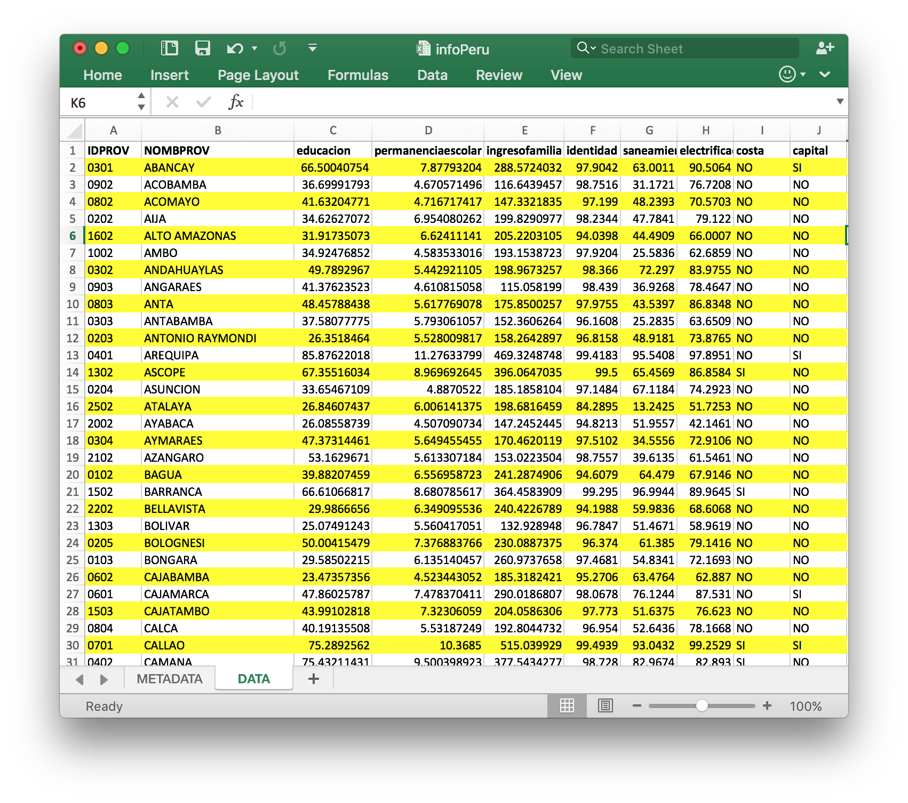
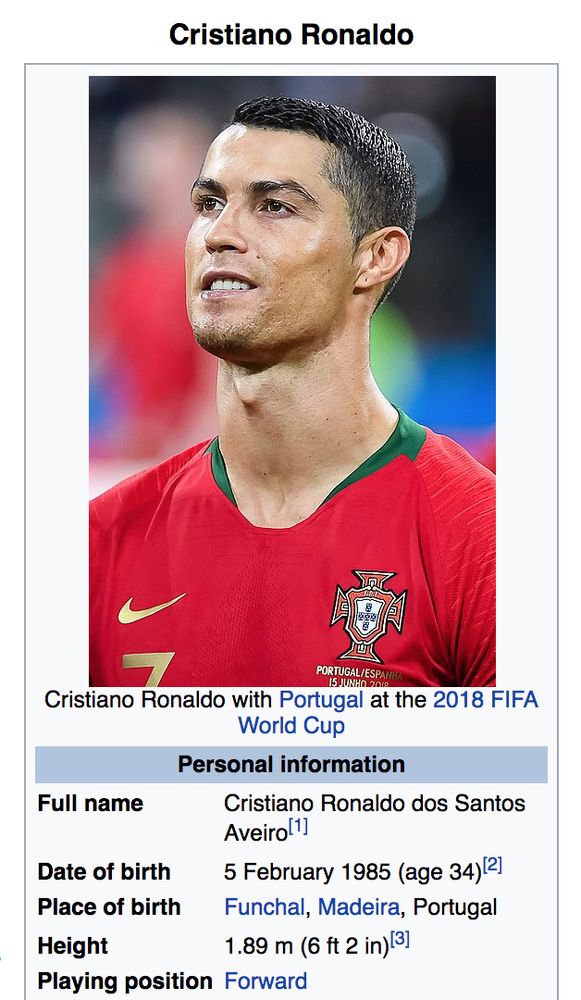
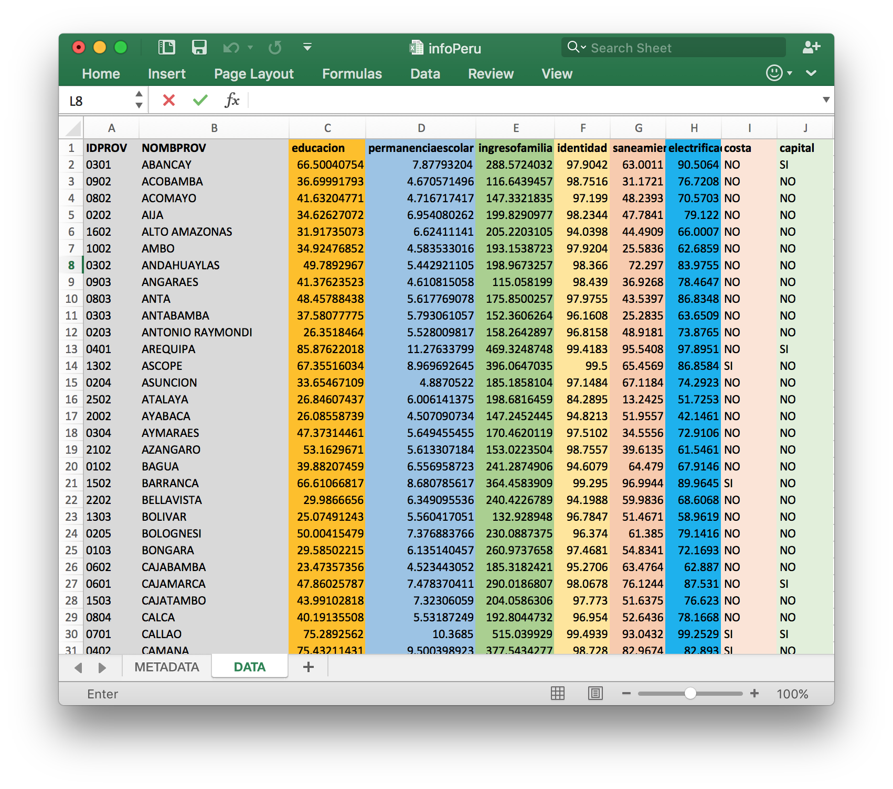

<br> 
<center></center>


## Course: Data-Driven Management and Policy

### Prof. José Manuel Magallanes, PhD 

_____

# Session 3: Data Structures


<a id='beginning'></a>

Before starting, keep in mind the following ideas:

* Computers and  humans need some structure in their language to communicate.
* Different from humans, we should not allowed the computer to guess what we mean. Then, talking to the computer has to follow a particular set of rules so our orders are unambiguos. 
* Errors happen when we do not speak clearly to the computer; but it is worse if the computer does something we did not mean.
* Data structures is the way the computer organizes pieces of data, so it can be stored, retrieved, used and modified.


We are going to talk about 3 data structures in R:

1. [Lists.](#part1) 
2. [Vectors.](#part2) 
3. [Data Frame.](#part3) 

**Lists** and **vectors** are simple structures; a **data frame** is a more complex one (built from the simple ones). 

----

<a id='part1'></a>

## List

Lists are containers of values. The values can be of any kind (numbers or non-numbers), and even other containers (simple or complex). 

If we have an **spreadsheet** as a reference, a row is a 'natural' list.



Then this can be a list:


```{r, eval=FALSE}
DetailStudent=list("Fred Meyers",
                   40,
                   FALSE)
```

The *object* _DetailStudent_ serves to store _temporarily_ the list in the computer. To name a list, use combinations of letters and numbers in a meaningful way (do not start with a number or a special character).

Typing the name of the object _DetailStudent_, now representing a list, will give you all the contents you saved in there:


```{r, eval=FALSE}
DetailStudent
```

The list above has three elements. However, you may be wondering if those elements have a meaning altogether. In those situations, it is better to have names for each elements.


```{r, eval=FALSE}
DetailStudent=list(fullName="Fred Meyers",
                   age=40,
                   female=FALSE)
```


```{r, eval=FALSE}
# seeing the result
DetailStudent
```

This list has three elements, which we can also call _fields_. Each of these, in this case, holds a different data type:

* *FullName* holds characters
* *age* holds a number
* *female* holds a logical (Boolean) value.

You can access any of those elements using these approaches:


```{r, eval=FALSE}
# position
DetailStudent[[1]]
```


```{r, eval=FALSE}
# name of the field
DetailStudent[['fullName']]
```


```{r, eval=FALSE}
# name of the field
DetailStudent$fullName
```

If you do not have _names_ for the list fields, you can only access them using positions:


```{r, eval=FALSE}
NewList=list('a','b','c','d',1,2,3)
NewList[[1]]
```

Once you access an element, you can alter it:


```{r, eval=FALSE}
DetailStudent[[1]]='Alfred Mayer'
# Then:
DetailStudent
```

You can even add an totally NEW field like this:


```{r, eval=FALSE}
DetailStudent$city='Seattle'

# show:
DetailStudent
```

And destroy it by **NULL**ing it, like this:


```{r, eval=FALSE}
DetailStudent$city=NULL # do you like: DetailStudent[[4]]=NULL
DetailStudent
```

You can get rid of a list using:


```{r, eval=FALSE}
rm(DetailStudent)
DetailStudent
```

** How would you create a list of this person out of his personal information data?**





```{r, eval=FALSE}
cr7=list('FullName'='Cristiano Ronaldo dos Santos Aveiro', 
         'DateOfBirth'='5 February 1985',
         'PlaceOfBirth'='Funchal, Madeira, Portugal',
         'HeightInMeters'=1.89,
         'PlayingPosition'='Forward'
        )
```


```{r, eval=FALSE}
#seeing the result:
cr7
```

The previous list has nothing wrong. But keep in mind that we save data to retrieve it and act (decide) upon its value. For example, can we answer the question:

* What is Ronaldo's playing position?


```{r, eval=FALSE}
cr7$PlayingPosition
```

Great! However, we can not answer, directly:

* How old is he?


```{r, eval=FALSE}
# what is today? 
today - cr7$DateOfBirth
```

Right way:


```{r, eval=FALSE}
Sys.Date()
```


```{r, eval=FALSE}
# Then,
Sys.Date() - cr7$DateOfBirth
```

The problem is that _DateOfBirth_ is not a date, is simply a text.


```{r, eval=FALSE}
cr7$DateOfBirth; str(cr7$DateOfBirth)
```


```{r, eval=FALSE}
# udpating
# some may need: Sys.setlocale("LC_TIME", "English")

cr7$DateOfBirth=as.Date(cr7$DateOfBirth,format="%d %B %Y");str(cr7$DateOfBirth)
```

Using the right [format](https://www.statmethods.net/input/dates.html) will allow you to accomplish what you need:


```{r, eval=FALSE}
# then

Sys.Date()-cr7$DateOfBirth
```

Or, in a simpler way (with the help of lubridate package):


```{r, eval=FALSE}
library(lubridate)

# how many years:
# notice I am using 2 functions: interval and time_length

time_length(interval(cr7$DateOfBirth,Sys.Date()),"years")
```

[Go to page beginning](#beginning)

----

<a id='part2'></a> 

## Vectors
Vectors are also containers of values. The values should be of only __one__ type (__R__ may alter or _coerce_ them silently, otherwise). If we have an spreadsheet as a reference, a column can be a natural vector.



Here, we will create three vectors using the "**c(...)**" function: 


```{r, eval=FALSE}
fullnames=c("Fred Meyers","Sarah Jones", "Lou Ferrigno","Sky Turner")
ages=c(40,35, 60,77)
female=c(F,T,T,T)
```

Each *object* is holding temporarily a vector. Use combinations of letters and numbers  in a meaningful way to name a vector (never start with a number or a special character). When typing the name of the object you will get all the contents:


```{r, eval=FALSE}
fullnames
```


```{r, eval=FALSE}
ages
```


```{r, eval=FALSE}
female
```

Each vector is composed of elements with the same type. If you want to access individual elements, you can write:


```{r, eval=FALSE}
fullnames[1]
```


```{r, eval=FALSE}
# or
ages[1]
```


```{r, eval=FALSE}
# or
female[1]
```

You can alter the vector using any of the above mechanisms:


```{r, eval=FALSE}
names[1]='Alfred Mayer'
# Then:
names[1]
```

You can add an element to a vector like this:


```{r, eval=FALSE}
elements=c(1,20,3)
elements=c(elements,40) # adding to the same one
elements
```

You can NOT delete it with NULL:


```{r, eval=FALSE}
elements
elements[4]=NULL
```

Just do this:


```{r, eval=FALSE}
# by position
elements
elements2=elements[-2] # vector 'without' position 4
elements2
```


```{r, eval=FALSE}
# by value
elements3=elements[elements!=20]
elements3
```

You can get rid of those vectors using:


```{r, eval=FALSE}
rm(elements2)
elements2
```

Another operation is to get rid of repeated values, R will not complaint if they exist:


```{r, eval=FALSE}
weekdays=c('M','T','W','Th','S','Su','Su')
weekdays
```

Then, use the function _unique_:


```{r, eval=FALSE}
unique(weekdays)
```

Vector elements can have 'names', but their contents still need to be homogeneous:


```{r, eval=FALSE}
newAges=c("Sam"=50, "Paul"=30, "Jim"="40")
newAges
```

As you see above, the presence of "Jim" as an element, *coerced* the other values to *characters* (the _numbers_ are now _text_, the symbol **''** is used to show that). Updating that value, will not change the vector type:


```{r, eval=FALSE}
newAges["Jim"]=20
newAges
```

Updating the vlaue will not take away the initial coercion.

Then, you could tell explicitly to change the _mode_ of the vector:


```{r, eval=FALSE}
storage.mode(newAges)
```


```{r, eval=FALSE}
storage.mode(newAges)='double' # or integer
newAges
```

The more familiar function _as.numeric_ can be used, but that will also delete the field names:


```{r, eval=FALSE}
newAges=as.numeric(newAges)
newAges
```

### Vectors versus Lists

Let me share some ideas for comparing these two basic structures:

__A) Make sure what you have:__

The functions **is.vector**, **is.list**, **is.character** and **is.numeric** should be used frequently, because we need to be sure of what structure we are dealing with:


```{r, eval=FALSE}
aList=list(1,2,3)
aVector=c(1,2,3)

is.vector(aVector); is.list(aVector)
```


```{r, eval=FALSE}
# then:
is.vector(aList,mode='vector'); is.list(aList)
```

The function **str** could be another alternative to find out what we have:


```{r, eval=FALSE}
str(aVector)
```


```{r, eval=FALSE}
str(aList)
```

__B) Arithmetics:__

You will find great differences when doing arithmetics:


```{r, eval=FALSE}
# if we have these vectors:
numbers1=c(1,2,3)
numbers2=c(10,20,30)
numbers3=c(5)
numbers4=c(1,10)
```

Then, these work well:


```{r, eval=FALSE}
# adding element by element:
numbers1+numbers2
```


```{r, eval=FALSE}
# adding 5  to all the elements of other vector:
numbers2+numbers3
```


```{r, eval=FALSE}
# multiplication (element by element):
numbers1*numbers2
```


```{r, eval=FALSE}
# and this kind of multiplication:
numbers1 * numbers3
```

However, R will give another warning here:


```{r, eval=FALSE}
numbers1+numbers4 # different size matters!
```

Comparissons make sense:


```{r, eval=FALSE}
numbers1>numbers2
```


```{r, eval=FALSE}
# but:
numbers1>numbers4
```

Now, let's see how the previous operations work here. These are our lists:


```{r, eval=FALSE}
numbersL1=list(11,22,33)
numbersL2=list(1,2,3)
```

...the _adding_ can not be interpreted:


```{r, eval=FALSE}
numbersL1+numbersL2
```

... and neither the comparisons...


```{r, eval=FALSE}
numbersL1>numbersL2
```

So do not expect neither of these to work:


```{r, eval=FALSE}
numbersL1*numbersL2
```


```{r, eval=FALSE}
numbersL1*3
```

[Go to page beginning](#beginning)

----

<a id='part3'></a>

## Data Frames

Data frames are containers of values. You use a data frame because you need to combine what vectors and lists do. The most common analogy is a data table like  the ones in a __spreadsheet__: 


```{r, eval=FALSE}
# VECTORS
names=c("Qing", "Françoise", "Raúl", "Bjork")
ages=c(32,33,28,30)
country=c("China", "Senegal", "Spain", "Norway")
education=c("Bach", "Bach", "Master", "PhD")

#DF as a "List" of vectors:
students=data.frame(names,ages,country,education)
students
```

You see your data frame above. Just by watching, you can not be sure of what you have, so using **str** is highly recommended:


```{r, eval=FALSE}
str(students)
```

This data frame uses the vector 'names' as the __row names__, so that vector is not considered a column, that is fine:

By default, R turns text vectors into factors (categorical values)You can avoid that by writing:


```{r, eval=FALSE}
students=data.frame(names,ages,country,education,
                    stringsAsFactors=FALSE)
str(students)
```

The function _str_ showed you the dimensions of the structure (number of rows and columns); R has alternative ways to get the dimensions:


```{r, eval=FALSE}
dim(students)
```


```{r, eval=FALSE}
#also
nrow(students) ; ncol(students) 
```


```{r, eval=FALSE}
# and very important:
length(students)
```

We know _length_ works for vectors and lists. In data frames, it gives you number of columns, NOT rows. 

Data frames have the functions __head()__, which is very useful to show the top rows of the dataframe:


```{r, eval=FALSE}
head(students,2) # top 2
```

Of course, we have __tail__:


```{r, eval=FALSE}
tail(students,2) # last 2
```

You can access data frames elements in an easy way:


```{r, eval=FALSE}
# one particular column
students$names
```


```{r, eval=FALSE}
# two columns using positions
students[,c(1,4)]
```


```{r, eval=FALSE}
## two columns using names of columns
students[,c('names','education')]
```

Using positions is the best way to get several columns:


```{r, eval=FALSE}
students[,c(1,3:4)] # ':' is used to facilitate 'from-to' sequence
```

Of course, you can create a new object with **subsets**:


```{r, eval=FALSE}
studentsNoEd=students[,c(1:3)]
studentsNoEd
```

You can modify any values in a data frame. Let me create a copy of this data frame to play with:


```{r, eval=FALSE}
studentsCopy=students # I make a copy to avoid altering my original dataframe
```

Now, I can change the age of Qing to 23 replacing 32:


```{r, eval=FALSE}
studentsCopy[1,2]=23
# change is immediate! (you will not get any warning)
studentsCopy[1,]
```

We can set a column as **missing**:


```{r, eval=FALSE}
studentsCopy$country=NA
```


```{r, eval=FALSE}
studentsCopy
```

And, delete a column by **null**ing it:


```{r, eval=FALSE}
studentsCopy$ages=NULL
```


```{r, eval=FALSE}
studentsCopy
```

### Querying Data Frames:

Once you have a data frame you can start writing interesting queries (notice the use of _commas_):

**Who is the oldest in the group?**


```{r, eval=FALSE}
students[which.max(students$ages),] 
```

**Who is the youngest in the group?**


```{r, eval=FALSE}
students[which.min(students$ages),] 
```

**Who is above 30 and from China?**


```{r, eval=FALSE}
students[students$ages>30 & students$country=='China',] 
```

**Who is not from Norway?**


```{r, eval=FALSE}
students[students$country!="Norway",] 
```

**Who is from one of these places?**


```{r, eval=FALSE}
Places=c("Peru", "USA", "Spain")
students[students$country %in% Places,] 
```


```{r, eval=FALSE}
# the opposite
students[!students$country %in% Places,] 
```

**The education level of the one above 30 year old and from China?**


```{r, eval=FALSE}
students[students$ages>30 & students$country=='China',]$education 
```

**Show me the data ordered by age (decreasing)?**


```{r, eval=FALSE}
students[order(-ages),]
```


----

* [Go to page beginning](#beginning)
* [Go to Course schedule](https://ds4ps.org/ddmp-uw-class-spring-2019/schedule/)


```{r, eval=FALSE}

```
