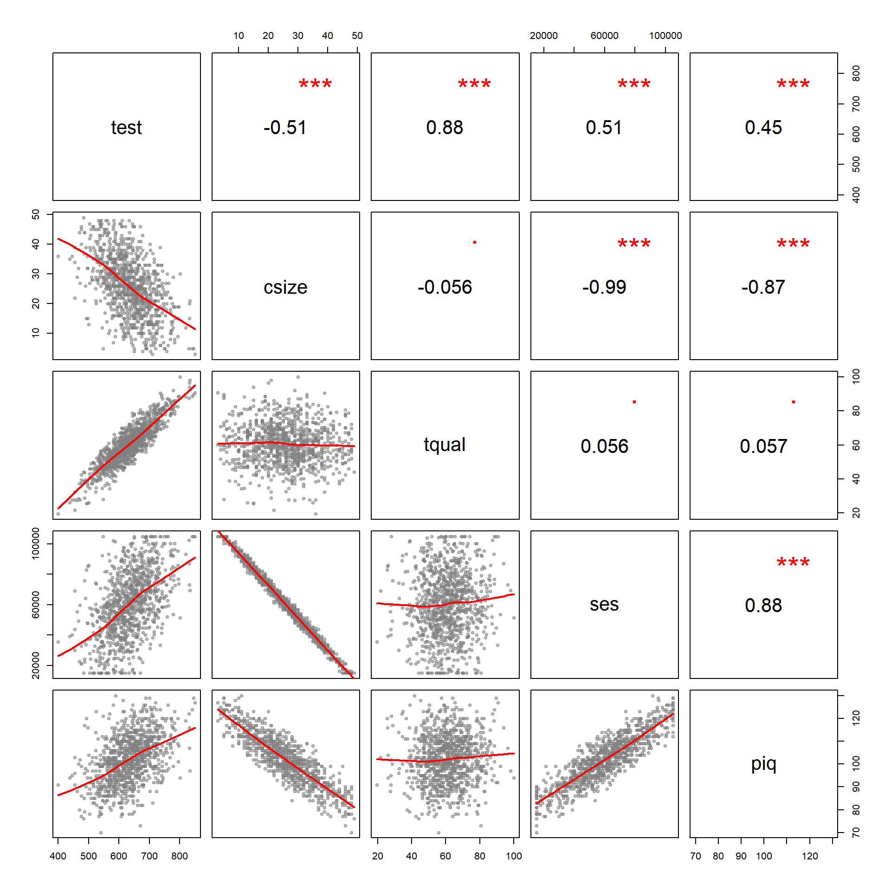

We estimate the following models:

$TestScore = b_0 + b_1 \cdot ClassSize + e_1 \ \ \ (Model \ 1)$

$TestScore = b_0 + b_1 \cdot ClassSize + b_2 \cdot TeacherQuality + e_2  \ \ \ (Model \ 2)$


$TestScore = b_0 + b_2 \cdot TeacherQuality + b_3 \cdot SES + e_3  \ \ \ (Model \ 3)$

$TestScore = b_0 + b_1 \cdot ClassSize + b_3 \cdot SES + e_4  \ \ \ (Model \ 4)$

$TestScore = B_0 + B_1 \cdot ClassSize + B_2 \cdot TeacherQuality + B_3 \cdot SES + \epsilon  \ \ \ (Model \ 5)$


<table style="text-align:center"><tr><td colspan="6" style="border-bottom: 1px solid black"></td></tr><tr><td style="text-align:left"></td><td colspan="5">Dependent Variable: Test Scores</td></tr>
<tr><td></td><td colspan="5" style="border-bottom: 1px solid black"></td></tr>
<tr><td style="text-align:left"></td><td>Model 1</td><td>Model 2</td><td>Model 3</td><td>Model 4</td><td>Model 5</td></tr>
<tr><td style="text-align:left"></td><td>(1)</td><td>(2)</td><td>(3)</td><td>(4)</td><td>(5)</td></tr>
<tr><td colspan="6" style="border-bottom: 1px solid black"></td></tr><tr><td style="text-align:left">Classroom Size</td><td>-3.52<sup>***</sup></td><td>-3.18<sup>***</sup></td><td></td><td>-2.98<sup>*</sup></td><td>-2.50<sup>***</sup></td></tr>
<tr><td style="text-align:left"></td><td>(0.19)</td><td>(0.02)</td><td></td><td>(1.75)</td><td>(0.17)</td></tr>
<tr><td style="text-align:left"></td><td></td><td></td><td></td><td></td><td></td></tr>
<tr><td style="text-align:left">Teacher Quality</td><td></td><td>4.85<sup>***</sup></td><td>4.86<sup>***</sup></td><td></td><td>4.85<sup>***</sup></td></tr>
<tr><td style="text-align:left"></td><td></td><td>(0.02)</td><td>(0.02)</td><td></td><td>(0.02)</td></tr>
<tr><td style="text-align:left"></td><td></td><td></td><td></td><td></td><td></td></tr>
<tr><td style="text-align:left">Socio-Economic Status</td><td></td><td></td><td>0.001<sup>***</sup></td><td>0.0003</td><td>0.0003<sup>***</sup></td></tr>
<tr><td style="text-align:left"></td><td></td><td></td><td>(0.0000)</td><td>(0.001)</td><td>(0.0001)</td></tr>
<tr><td style="text-align:left"></td><td></td><td></td><td></td><td></td><td></td></tr>
<tr><td style="text-align:left">Intercept</td><td>725.49<sup>***</sup></td><td>422.24<sup>***</sup></td><td>250.71<sup>***</sup></td><td>696.48<sup>***</sup></td><td>385.11<sup>***</sup></td></tr>
<tr><td style="text-align:left"></td><td>(5.22)</td><td>(1.09)</td><td>(1.16)</td><td>(94.21)</td><td>(9.34)</td></tr>
<tr><td style="text-align:left"></td><td></td><td></td><td></td><td></td><td></td></tr>
<tr><td colspan="6" style="border-bottom: 1px solid black"></td></tr><tr><td style="text-align:left">Observations</td><td>1,000</td><td>1,000</td><td>1,000</td><td>1,000</td><td>1,000</td></tr>
<tr><td style="text-align:left">Adjusted R<sup>2</sup></td><td>0.26</td><td>0.99</td><td>0.99</td><td>0.26</td><td>0.99</td></tr>
<tr><td colspan="6" style="border-bottom: 1px solid black"></td></tr><tr><td style="text-align:left">Standard errors in parentheses</td><td colspan="5" style="text-align:right"><sup>*</sup>p<0.1; <sup>**</sup>p<0.05; <sup>***</sup>p<0.01</td></tr>
</table>


## Lab-02 Questions:

Warm-up: Interpret the slope associated with Class Size in Model 01. What does a slope of -3.52 mean in this context? Is the negative sign a good thing or a bad thing?  

--- 

For the following cases, use the value t=1.96 for the 95% confidence interval calculations.

(1)	What is the standard error associated with the slope on class size in Model 1?


(2)	Calculate the 95% confidence interval around the class size coefficient in Model 1.  Is it statistically significant at this level?  How do you know?

(3)	Calculate the 95% confidence interval around the class size coefficient in Model 2.   Is it significant at this level? How do you know?

(4)	Calculate the 95% confidence interval around the class size coefficient in Model 4.  Is it significant at this level? How do you know?

(5)	Draw the three confidence intervals to see how they change (you can do this in any drawing tool, with R, in MS Word or PowerPoint, or by hand).

(6)	The covariance of class size and test scores is -348, and the variance of class size is 99.  Can you calculate the slope of class size in Model 4 with the formula cov(x,y)/var(x)?  Why or why not?

---


R code for coefficient plots to adapt if desired:


```r
mod1.slope    <- -2.01
mod1.ci.lower <- -3
mod1.ci.upper <- -1

mod2.slope     <- -2.32
mod2.ci.lower <- -5
mod2.ci.upper <- 1

# etc.

# slopes <- c( mod1.slope, mod2.slope, ... mod5.slope )
# ci.lower <- c( mod1.ci.lower, mod2.ci.lower, ... mod5.ci.lower )
# ci.upper <- c( mod1.ci.upper, mod2.ci.upper, ... mod5.ci.upper )
# model.labels <- c("Model 1", "Model 2", ... "Model 5")

slopes <- c( mod1.slope, mod2.slope )
ci.lower <- c( mod1.ci.lower, mod2.ci.lower )
ci.upper <- c( mod1.ci.upper, mod2.ci.upper )
model.labels <- c("Model 1", "Model 2")

min.x <- min( ci.lower )
max.x <- max( max( ci.upper ), 1 )

plot( -8:3, -8:3, bty="n", type="n", yaxt="n", 
      ylab="", xlab="Slope for Class Size",
      xlim=c(min.x-1,max.x+1), ylim=c(0,length(slopes)+1) )

abline( v=0, col="darkgray" )   # null hypothesis

segments( x0=ci.lower, x1=ci.upper, y0=1:length(slopes), 
          col="orange", lwd=2 )

points( slopes, 1:length(slopes), pch=19, col="orange", cex=2 )

text( slopes, 1:length(slopes), model.labels, 
      col="darkgray", pos=3, cex=1.2, offset=1 )
```


# Note on Reading Regression Tables

It is common to compare regression models with different specification (including or excluding variables) to ensure we have the best fit. To present multiple models compactly we display each model as a column in the table. You can read them as follows:


# Submission Instructions

After you have completed your lab submit via Canvas. Login to the ASU portal at <http://canvas.asu.edu> and navigate to the assignments tab in the course repository. Upload your RMD and your HTML files to the appropriate lab submission link. Or else use the link from the Lab-02 tab on the Schedule page. 

Remember to name your files according to the convention: **Lab-##-LastName.xxx**


<br>
<br>

