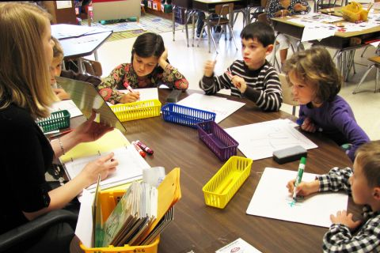

```{r setup, include=FALSE}
knitr::opts_chunk$set(echo=F, fig.width=9, fig.height=6, warning=F, message=F )
```

This lab introduces a case study on education policy that we will be using for the remainder of the semester to demonstrate the importance and impact of control variables, and consequences of their omissions (a problem called "omitted variable bias"). 

First read the case studies, then answer the questions below. 


-----


# THE GREAT DEBATE


-----


<iframe width="560" height="315" src="https://www.youtube.com/embed/I43hLrEaWXY" frameborder="0" allow="accelerometer; autoplay; encrypted-media; gyroscope; picture-in-picture" allowfullscreen></iframe>


## [The Class Size Debate: What the Evidence Means for Education Policy](https://gspp.berkeley.edu/research/featured/the-class-size-debate-what-the-evidence-means-for-education-policy)

September 23, 2015


By Darian Woods



_“The days in which lawmakers support schools that are somehow good enough for someone else’s children, but not for their own – those days must be over.” - Arne Duncan, U.S. Education Secretary, January 12, 2015_  
  
**Why class sizes?**  
  
The more students a teacher is responsible for, the harder it is to teach. That’s hard to argue with. Yet the research and policy around this idea is surprisingly controversial. We can say with confidence that smaller class sizes improve grades for younger learners. But the answers to deeper questions are less clear.  
  
The issue of class sizes is a live policy debate. Teachers unions from Oakland, California to Auckland, New Zealand are advocating for smaller class sizes. A call for smaller class sizes was second only to higher salaries for the LA teachers union at recent protests. The president of the National Education Association, Lily Eskelsen García, attributes fighting for smaller class sizes as her motivation for becoming an education activist.   
  
The idea of smaller class sizes is strongly supported by teachers and the general public. A national survey of 50,000 Americans found that reducing class sizes was perceived to be the best way to reform schools. And yet when public budgets are tight, class sizes are quick to grow. California’s class size cap increased substantially following the Great Recession.  
  
While there is evidence that smaller class sizes improve student learning, the magnitude of the impact must be weighed against the impact of other reforms. For example, would paying higher salaries to retain a high-quality teacher workforce be money better spent?   
  
The question of which students would benefit is also important: would smaller classes improve high achievers’ learning more than, say, students who are still catching up? Or would the gains in learning be spread out broadly among the children in the class?   
  
Jessica Tyson, a history and English teacher at Oakland Technical High School, said that the issue is more than just the right size of an individual classroom.  It’s also about making room for better lesson preparation.   
  
“Teaching fewer hours and having that extra hour in the day to collaborate, plan, grade and reflect on what students are doing would be very helpful to me,” Tyson said.   
  
“U.S. teachers spend more time in front of students by a significant margin than in other developed countries,” she said. “I was struck by how wonderful it would be … if I could just teach slightly less, how much more I could do.”  
  
**The Evidence on Class sizes**  
  
To answer the question of how much difference smaller classrooms make for student learning, we need good data and strong analytic methods that can isolate the effect of class sizes. Researchers do not want to accidentally pick up other effects such as differences in school resources, for example, or difference in students’ characteristics or parental involvement.   
  
Two of best studies we have on this issue – Project STAR and a 1999 analysis of Israeli schools by economists Joshua Angrist and Victor Lavy – address these problems. They both show a positive effect from smaller school sizes in the first few years of school. I discuss this research in greater detail below.   
  
**Placing children in random class sizes: Lessons from Project STAR**  
  
Much of what we know about class sizes comes from an experiment called Project STAR (also known as the Tennessee Study). From 1985 to 1989 11,600 Tennessee students from kindergarten to third grade were randomly assigned to three class-size categories. The three class sizes were 13–17 students, 22–25 students and over 25 students.   
  
The results were strong. An average student assigned to the smallest classes had a reading score nearly 8 percent higher than students in the medium-sized classes. The smaller-class students, on average, achieved 9 percent higher math scores. (See the paper here.)   
  
Students in smaller classes who completed high school were more likely to take college-entrance exams than students assigned to medium or large classes. The effects are even stronger for minority and less affluent students.   
  
Education economists Alan Krueger and Diane Schanzenbach calculate that, based on Project STAR’s results, reducing class sizes from 22 to 15 students has a 5.5 percent return in annual benefits. This takes into account students’ increased lifetime earnings.  
  
Project STAR generated the best data we have on class sizes, but findings should be interpreted carefully. First, the experiment was conducted in larger urban schools, so results may not be as strong for smaller suburban schools. Second, it is hard to believe that the students were completely randomly assigned; it’s easy to imagine some motivated parents lobbied to move their children to the smaller classes. Finally, Tennessee is a much below-average state for education. This means the Project STAR students may have benefited from the class-size reductions more than students in higher-performing states might.   
  
This study also only looks at the effects on students who were in small classes in their first few years of school. Stanford economist Eric A. Hanushek and his colleague, Steven Rivkin, downplay the conclusion that many researchers draw from Project STAR – that smaller classes are a cost-effective policy to improve learning. In a 2006 paper emphasizing teacher quality over class sizes they are skeptical. “In only 40 out of 79 schools,” they write, “did the kindergarten performance in the small classroom exceed that in the regular classroom.” This is better than random (which would be an improvement in about 26 out of the 79 schools). Nevertheless, they argue, the results show too weak an effect to justify wholesale change to class sizes.  
  
Despite Hunushek and Rivkin’s reservations, Project STAR indicates room, on average, for improving test scores for children ages 5 to 8 in class sizes larger than 17 students. If real-world results replicate those found in the STAR project, we can expect higher student achievement by moving towards smaller classes.   
  
**Maimonides’ Rule: What a 12th Century rabbinic scholar can tell us about class sizes**  
  
Because the random allocation of students found in Project STAR is so rare, education researchers have found creative ways to mimic a randomized experiment. MIT professor Joshua Angrist and University of Warwick professor Victor Lavy use the unique education policy of modern Israel to study class sizes. The researchers harness Israel’s rule that public school classrooms must not have more than 40 students, inspired by 12th Century rabbinic scholar Maimonides who advocated class sizes smaller than 40 students.   
  
After 41 students are enrolled, the class splits into two. This continues after each multiple of 40. Class size is therefore related to the random chance of how close school enrollment is to a multiple of 40 and less related to confounding variables. Socioeconomic characteristics schools are controlled for.   
  
For 5th grade students, Angrist and Lavy find a 10-student increase in class size explains a 6.5 percent drop in the average student’s reading comprehension scores and 4.5 percent drop in math scores. Angrist and Lavy do not find statistically significant effects of class size for third graders, possibly due to test-score training that year. The 5th grade effects of class size on achievement are strong, giving further evidence that class sizes matter. The non-effects and weak effects of class size on 4th and 5th graders highlights some uncertainty in the literature and data.  
  
**The heart of the academic debate on class sizes **  
  
Significant and insignificant results pepper the class size literature. Karen Akerhielm, a graduate of Yale’s economics PhD program, finds a 10-student reduction in class sizes explains approximately a 5 percent improvement in science and history test scores. Stanford economist Caroline Hoxby, in a 2000 paper, cannot find a relationship between school districts’ test scores and estimated class sizes. She also cannot find any evidence that the effect is stronger for schools with a higher proportion of low-income or African American students. This is in contrast to the strong effects found in the STAR project.   
  
Conflicting results such as these in the literature – and differing opinions on how to weight the findings of each paper in meta-analyses – have meant that two of the most prominent researchers in the field, Hanushek and Krueger, draw different conclusions. In the 2002 book The Class Size Debate Hanushek writes, “despite the political popularity of overall class size reduction, the scientific support of such policies is weak to nonexistent.” In the same book Krueger (2002) writes, “the strongest available evidence suggests a connection” and that reducing class sizes from 22 to 15 students per teacher has a positive benefit-cost-ratio at a real discount rate lower than 6%.   
  
While this academic debate over the methods and results of experiments on class size reduction continues, the issue has lost much of its momentum in education policy circles. Much of this goes back to the related debate about what kind of reforms produce the biggest impact for the money spent.   
  
Eric A. Hanushek, for example, argues that focusing on teacher quality over class sizes yields a better return on one’s investment. In an influential 2005 paper on factors that influence student achievement, Hanushek compares reducing a class by ten students to switching the teacher with a moderately better replacement.  
  
“The effects of a costly ten-student reduction in class size are smaller,” Hanushek says.  
  
Hanushek is not claiming that smaller classes are ineffective at improving achievement, just that it may not be the right priority. The verdict is still out whether an increase in ‘teacher quality’ is an appropriate comparison in terms of cost and amenability to policy changes. When we talk about improving teacher quality rather than decreasing class sizes, are we talking about higher salaries to attract and retain better teachers? Are we talking about higher credential requirements for new teachers (which has been shown to be ineffective)? Are we talking about more on-the-job training? Teacher quality means different things to different people; this suggests caution should be taken when comparing teacher quality with class sizes.    
  
**In short…**  
  
Despite strong arguments on both sides of the debate, there are reasons why we should take small class sizes seriously. The methodologically strongest experiment, the STAR experiment, shows strong results. Positive results are commonly found in the literature. Private schools reveal parents’ and teachers’ preferences for smaller student-teacher ratios. School sizes are large in many U.S. school districts, and the problem may be even worse than the official statistics.  
  
“Most of the class sizes I’ve had have been around 28 people,” Oakland teacher, James Malamut, said. “When I worked for the School District of Philadelphia it was 31 on paper, but there would be times when it was closer to 35. They’d sneak a few kids in there unofficially.”  
  
When teachers repeatedly raise an issue, policymakers should listen. Teachers close to the actual practice of teaching strongly believe in reducing the student-to-teacher ratio. A 2007 survey found that 81 percent of American teachers would prefer smaller class sizes over higher salaries.  
  
“I think it would have a really significant impact,” Malamut said. “I’d be able to give more individualized attention in the class. I’d have more time for preparation. And when grading I’d be able to give more individualized feedback.”  
  
The evidence on the relationship between class size and achievement is not conclusive but there is good reason to believe that smaller classes could be beneficial to students in the early years of primary school and especially for minorities and low-achieving students. Whether it follows that class-size reductions are poor value-for-money is less certain. Reducing class sizes, particularly for 6- to 14-year-olds where the evidence is strongest, should be considered – alongside teacher training, salaries, accreditation, and collaboration initiatives – as a serious albeit expensive policy option to improve educational outcomes and reduce educational outcome disparities. Does class size matter? It certainly does.

[Darian Woods](https://www.linkedin.com/in/darian-woods-558a978a) is a Master of Public Policy candidate 2016 at the Goldman School of Public Policy at University of California, Berkeley.

_This article was originally posted on_PolicyMatters Journal_, a publication put forth by the graduate students of GSPP._


-----


# BIG BETS


-----


## [State Regulation of Class Size](https://www.publicschoolreview.com/blog/class-size-state-regulation-of-class-size)

*Updated December 21, 2017* 
*Grace Chen*

**State Laws Limiting Class Size**
 
California – The state of California became a leader in promoting class size reduction in 1996 when it commenced a large-scale class size reduction program with the goal of reducing class size in all kindergarten through third-grade classes from 30 to 20 students or less. **The cost of the program was $1 billion annually.**
 
Florida – Florida residents in 2002 voted to amend the Florida Constitution to set the maximum number of students in a classroom. The maximum number varies according to the grade level. For pre-kindergarten through third grade, fourth grade through eighth grade, and ninth grade through 12th grade, the constitutional maximums are 18, 22, and 25 students, respectively. Schools that are not already in compliance with the maximum levels are required to make progress in reducing class size so that the maximum is not exceeded by 2010. The Florida legislature enacted corresponding legislation, with additional rules and guidelines for schools to achieve the goals by 2010.
 
Georgia - Maximum class sizes depend on the grade level and the class subject. For kindergarten, the maximum class size is 18 or, if there is a full-time paraprofessional in the classroom, 20. Funding is available to reduce kindergarten class sizes to 15 students. For grades one through three, the maximum is 21 students; funding is available to reduce the class size to 17 students. For grades four through eight, 28 is the maximum for English, math, science, and social studies. For fine arts and foreign languages in grades K through eight, however, the maximum is 33 students. Maximums of 32 and 35 students are set for grades nine through 12, depending on the subject matter of the course. Local school boards that do not comply with the requirements are subject to lose funding for the entire class or program that is out of compliance.


-----


# THE GATES EXPERIMENTS


-----


## ['An Expensive Experiment': Gates Teacher-Effectiveness Program Shows No Gains for Students](https://www.edweek.org/ew/articles/2018/06/21/an-expensive-experiment-gates-teacher-effectiveness-program-show.html)

By Madeline Will
June 21, 2018

The Bill & Melinda Gates Foundation’s multi-million-dollar, multi-year effort aimed at making teachers more effective largely fell short of its goal to increase student achievement—including among low-income and minority students, a new study found.

This conclusion to an expensive chapter of teacher-evaluation reform shows the difficulty of making sweeping, lasting changes to teacher performance. The results also demonstrate the challenges of getting schools and teachers to embrace big changes, especially when state and local policies are in flux.

The evaluation of the program, released today, was conducted by the RAND Corporation with the American Institutes for Research and was funded by the Gates Foundation.

Under its intensive partnerships for effective teaching program, the Gates Foundation gave grants to three large school districts—Memphis, Tenn. (which merged with Shelby County during the course of the initiative); Pittsburgh; and Hillsborough County, Fla.—and to one charter school consortium in California starting in the 2009-10 school year. The foundation poured $212 million into these partnerships over about six years, and the districts put up matching funds. The total cost of the initiative was $575 million.

The school sites agreed to design new teacher-evaluation systems that incorporated classroom-observation rubrics and a measure of growth in student achievement. They also agreed to offer individualized professional development based on teachers’ evaluation results, and to revamp recruitment, hiring, and placement. Schools also implemented new career pathways for effective teachers and awarded teachers with bonuses for good performance.

“The initiative itself tried to pull a bunch of levers to have a big impact on student performance,” said Brian Stecher, a RAND researcher and the lead author of the report. “The sites did in fact modify all of these levers, some more than others, but in the end, there were no big payoffs in terms of improved graduation [rates] or achievement of students in general, and low-income and minority students in particular.”

## [Bill Gates: ‘It would be great if our education stuff worked but’](https://www.washingtonpost.com/news/answer-sheet/wp/2013/09/27/bill-gates-it-would-be-great-if-our-education-stuff-worked-but/)

In this 2011 oped in The Washington Post, Gates wrote:

> What should policymakers do? One approach is to get more students in front of top teachers by identifying the top 25 percent of teachers and asking them to take on four or five more students.

Actually, that’s not an approach any educator I know would think is a good idea, but Gates had decided that class size doesn’t really matter. Earlier, he had put some $2 billion into forming small schools out of large high schools, on the theory that small schools would better serve students. When the initiative didn’t work out as he hoped, he moved on by spending hundreds of millions of dollars on teacher evaluation systems...


## [Once sold as the solution, small high schools are now on the back burner](https://hechingerreport.org/once-sold-as-the-solution-small-high-schools-are-now-on-the-back-burner/)

by MEREDITH KOLODNER 
September 29, 2015


Now a new national high school redesign effort has been launched, this one backed by $50 million from the Emerson Collective, whose president is Laurene Powell Jobs, wife of late Apple titan Steve Jobs. The newest philanthropic effort is staffed by some of the same experts who participated in the Gates experiment.

"Small" is no longer the watchword at the Super School Project; there's an emphasis on raising academic expectations, recruiting teams of educators who support one another and crafting a school culture where kids are known.

"School size is a way of talking about how you get to trusting relationships between adults and kids; size is an enabling condition," says Michele Cahill, who, as senior counselor to then-Chancellor Joel Klein, was in charge of the redesign of the city's high schools from 2002 to 2007, and is now an adviser to the Super School Project. "The exciting thing about this is we have evidence that shows the real impact of high school redesign, and we can apply those lessons."

But what are those lessons?

The first four years at Gateway, whose staff deeply believes that size matters, marked a significant improvement over what had come before and in some ways embodied the highest hopes of small-school advocates. It has no academic requirements to get in, and all of the kids come from low-income families. Close to 90 percent of its initial class graduated this year, and almost all have enrolled in college. The school clearly moves the needle: While 80 percent of students who enter are performing below grade level, 65 percent leave at or above it, according to a school official.

That's what small-school advocates like to hear. But the big picture is murkier.

Nationwide, the impact of the small-school initiatives has been decidedly mixed. A network of schools launched in Rhode Island posted impressive results, as did another that began in Minnesota and one in San Diego. But in many places, including Los Angeles and Oakland, California; North Carolina; Oregon and Boston, the more than $2 billion spent by the Bill & Melinda Gates Foundation over the course of a decade didn't move those cities close enough to Gates' goal of 80 percent graduation.

Certainly, some individual schools improved, but as a whole, cities and states didn't see significant increases in their high school graduation rates during that time. Although some criticize the Gates Foundation for giving up too soon, it stopped funding its national small-school initiative in 2010. (The Gates Foundation is among the funders of The Hechinger Report.)

...

On the plus side, a study by MDRC, an education policy research group, looked at students who enrolled in 102 of the 123 "academically nonselective" high schools created after 2002, and found that graduation rates averaged 72 percent, compared with 62 percent for students who had applied to the small schools but were randomly assigned to large ones. The vast majority of the 21,000 students studied were low-income and black or Latino.

...

"I think a lot of people make the mistake of just emphasizing the size as the thing," he said. "The size is an opportunity to reinvent the structure and the instructional practice of the school, and to change the relationships between the adults."

In fact, Mayor Bill de Blasio's administration has proposed merging some struggling schools with more successful ones, to create larger high schools. Officials on his education team say they believe an individualized approach to students – a central component of the small-schools movement – is key to a school's success, but that those relationships can be built within a variety of school configurations.

Despite some consternation about merging schools, the thinking about what size really means does seem to be evolving. So says Robert Hughes, who has been at the center of creating and supervising more than 100 small high schools since he became president of New Visions for Public Schools in 2000.

"I used to believe that small schools were the only way to go, and I still believe that they're very powerful," Hughes says. "But what's interesting is that, with some work, you can really build structures that enable kids to be known and to get the kind of support they need to be successful [even] in larger schools."

And while small schools did bump up graduation rates, in some neighborhoods the needs were so immense, and the schools so dysfunctional, that reformers hit a wall. About a dozen of the original small schools that replaced big ones have been closed for poor performance. Others remain open, but their results have been inadequate.

[recent speech by Gates summarizing learning](https://www.gatesnotes.com/Education/Council-of-Great-City-Schools)


---------------

# LAB-02:  Confidence Intervals


```{r, echo=F}
# see file generate-class-size-data.rmd
URL <- "https://raw.githubusercontent.com/DS4PS/cpp-523-fall-2019/master/labs/class-size-seed-1234.csv"
dat <- read.csv( URL )
```


In this assignment you will be working with simulated data on class size and test scores.  There is also a variable for socio-economic status and teacher quality.  We would like to understand how the relationship between class size and test scores changes when other variables are considered.  We will be looking specifically at the confidence interval around the classroom size slope estimate.

```{r, fig.width=10, fig.height=10, echo=F}

panel.cor <- function(x, y, digits=2, prefix="", cex.cor)
{
    usr <- par("usr"); on.exit(par(usr))
    par(usr = c(0, 1, 0, 1))
    r <- cor(x, y, use="pairwise.complete.obs")
    txt <- format(c(r, 0.123456789), digits=digits)[1]
    txt <- paste(prefix, txt, sep="")
    if(missing(cex.cor)) cex <- 0.8/strwidth(txt)
    
    test <- cor.test(x,y)
    # borrowed from printCoefmat
    Signif <- symnum(test$p.value, corr = FALSE, na = FALSE,
                  cutpoints = c(0, 0.001, 0.01, 0.05, 0.1, 1),
                  symbols = c("***", "**", "*", ".", " "))
    
    text(0.5, 0.5, txt, cex = 2 )
    text(.7, .8, Signif, cex=3, col=2)
}


panel.smooth <- function (x, y, col = par("col"), bg = NA, pch = par("pch"), 
  cex = 1, col.smooth = "red", span = 2/3, iter = 3, ...) 
{
  points(x, y, pch = 19, col = gray(0.5,0.5), 
         bg = bg, cex = 0.7)
  ok <- is.finite(x) & is.finite(y)
  if (any(ok)) 
    lines(stats::lowess(x[ok], y[ok], f = span, iter = iter), 
      col = col.smooth, lwd=2, ...)
}


pairs( dat[1:1000,], lower.panel=panel.smooth, upper.panel=panel.cor)

```


We estimate the following models:

$TestScore = b_0 + b_1 \cdot ClassSize + e_1 \ \ \ (Model \ 1)$

$TestScore = b_0 + b_1 \cdot ClassSize + b_2 \cdot TeacherQuality + e_2  \ \ \ (Model \ 2)$


$TestScore = b_0 + b_2 \cdot TeacherQuality + b_3 \cdot SES + e_3  \ \ \ (Model \ 3)$

$TestScore = b_0 + b_1 \cdot ClassSize + b_3 \cdot SES + e_4  \ \ \ (Model \ 4)$

$TestScore = B_0 + B_1 \cdot ClassSize + B_2 \cdot TeacherQuality + B_3 \cdot SES + \epsilon  \ \ \ (Model \ 5)$


```{r, results='asis', echo=F}
library( stargazer )

m1 <- lm( test ~ csize  ) 
m2 <- lm( test ~ csize + tqual )
m3 <- lm( test ~ tqual + ses ) 
m4 <- lm( test ~ csize + ses  )
m5 <- lm( test ~ csize + tqual + ses  )


stargazer( m1, m2, m3, m4, m5, 
           type = "html", digits=2,
           dep.var.caption = "Dependent Variable: Test Scores",
           # dep.var.labels = "",
           dep.var.labels.include = FALSE,
           omit.stat = c("rsq", "f", "ser"),
           column.labels = c("Model 1", "Model 2", "Model 3", "Model 4", "Model 5"),
           covariate.labels=c("Classroom Size",
                              "Teacher Quality",
                              "Socio-Economic Status",
                              "Intercept"),
           notes.label = "Standard errors in parentheses")
```


## Lab-02 Questions:

Warm-up: Interpret the slope associated with Class Size in Model 01. What does a slope of `r round(coef(m1)[2],2)` mean in this context? Is the negative sign a good thing or a bad thing?  

--- 

For the following cases, use the value t=1.96 for the 95% confidence interval calculations.

(1)	What is the standard error associated with the slope on class size in Model 1?


(2)	Calculate the 95% confidence interval around the class size coefficient in Model 1.  Is it statistically significant at this level?  How do you know?

(3)	Calculate the 95% confidence interval around the class size coefficient in Model 2.   Is it significant at this level? How do you know?

(4)	Calculate the 95% confidence interval around the class size coefficient in Model 4.  Is it significant at this level? How do you know?

(5)	Draw the three confidence intervals to see how they change (you can do this in any drawing tool, with R, in MS Word or PowerPoint, or by hand).

(6)	The covariance of class size and test scores is `r round(cov(csize,test),0)`, and the variance of class size is `r round(var(csize),0)`.  Can you calculate the slope of class size in Model 4 with the formula cov(x,y)/var(x)?  Why or why not?

---


R code for coefficient plots to adapt if desired:

```{r, echo=T}
mod1.slope    <- -2.01
mod1.ci.lower <- -3
mod1.ci.upper <- -1

mod2.slope     <- -2.32
mod2.ci.lower <- -5
mod2.ci.upper <- 1

# etc.

# slopes <- c( mod1.slope, mod2.slope, ... mod5.slope )
# ci.lower <- c( mod1.ci.lower, mod2.ci.lower, ... mod5.ci.lower )
# ci.upper <- c( mod1.ci.upper, mod2.ci.upper, ... mod5.ci.upper )
# model.labels <- c("Model 1", "Model 2", ... "Model 5")

slopes <- c( mod1.slope, mod2.slope )
ci.lower <- c( mod1.ci.lower, mod2.ci.lower )
ci.upper <- c( mod1.ci.upper, mod2.ci.upper )
model.labels <- c("Model 1", "Model 2")

min.x <- min( ci.lower )
max.x <- max( max( ci.upper ), 1 )

plot( -8:3, -8:3, bty="n", type="n", yaxt="n", 
      ylab="", xlab="Slope for Class Size",
      xlim=c(min.x-1,max.x+1), ylim=c(0,length(slopes)+1) )

abline( v=0, col="darkgray" )   # null hypothesis

segments( x0=ci.lower, x1=ci.upper, y0=1:length(slopes), 
          col="orange", lwd=2 )

points( slopes, 1:length(slopes), pch=19, col="orange", cex=2 )

text( slopes, 1:length(slopes), model.labels, 
      col="darkgray", pos=3, cex=1.2, offset=1 )
```


# Note on Reading Regression Tables

It is common to compare regression models with different specification (including or excluding variables) to ensure we have the best fit. To present multiple models compactly we display each model as a column in the table. You can read them as follows:


# Submission Instructions

After you have completed your lab submit via Canvas. Login to the ASU portal at <http://canvas.asu.edu> and navigate to the assignments tab in the course repository. Upload your RMD and your HTML files to the appropriate lab submission link. Or else use the link from the Lab-02 tab on the Schedule page. 

Remember to name your files according to the convention: **Lab-##-LastName.xxx**


<br>
<br>

