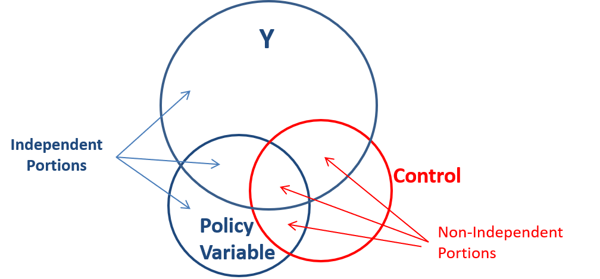
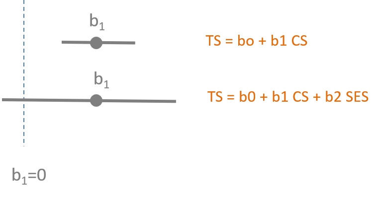

```{r setup, include=FALSE}
knitr::opts_chunk$set(echo=T, fig.width=9, fig.height=6, warning=F, message=F )
```

#### [CPP 523: Program Eval I](https://ds4ps.org/cpp-523-fall-2019/schedule/)

<br>

You will submit your solutions as an RMD document (specifically the HTML file created from the document). You can create a new RMarkdown file, or download the **LAB-04 RMD template**: 

[](https://www.dropbox.com/s/pqku4djvykyinbg/lab-04-template.rmd?dl=1)

<br>


## Study Overview

This lab will ask you to run a couple of models to examine the impact of omitted variable bias on your inferences. The key take-away is understanding the potential implications of omitted variable bias, that it is not a minor issue that causes modest problems with your analysis. It can fundamentally alter your understanding of the causal mechanisms you are trying to understand.

Th data set for the lab is from a study examining how social networks and support contribute to happiness ("subjective well-being"). 

_**Hoops, Anne. (March, 2006).   Investigating an Association Between Type A/B Behavior and Subjective Well-Being.**_

The dependent variable is called **Subjective Well Being (SWB)** - it is subjective because each individual gages their own level of happiness (because how else are we supposed to measure it?).  The independent variables for the study are:  

* **Network Diversity (ND)** – a measure of the scope and variability of a person’s social capital.   
* **Perceived Social Support (PSS)** – a person’s perception of how much support they receive from their social networks.  
* **Network Size (number of persons NP)** – the number of people that an individual counts in their social network of family and friends.   
* **Positive Affect Negative Affect Schedule (PANAS)** - gages a person's "affect" which is the general mood and is related to things like anxiety, depression and violence [reference](https://en.wikipedia.org/wiki/Positive_and_Negative_Affect_Schedule ).  
* **Student Jenkins Activity Survey (SJAS)** - which tries to develop a scale to measure a person's ambition relative to others. "Type A personality generally refers to hard workers who are often preoccupied with schedules and the speed of their performance. Type B personalities may be more creative, imaginative, and philosophical. The test consists of 30 multiple-choice items.  Scores range from 35 to 380.  Type A is associated with a high score while Type B is associated with a low score." [cite](http://www.psych.uncc.edu/pagoolka/TypeA-B-intro.html)  
* **Rosemberg Self Esteem Scale (RSE)** - one of many measures of self-esteem, a favorite variable in psychology. [reference](http://www.wwnorton.com/college/psych/psychsci/media/rosenberg.htm  ) 
* **Contingent Self Esteem (CSE)** -  "is based on the approval of others or on social comparisons. The success or failure of any situation can result in fluctuations of an individual's self-esteem. A manifestation of someone with contingent self-esteem is excessive self-consciousness...extreme criticism of one's self, concern of how they are perceived by their peers, and feelings of discomfort in social settings." [reference](https://en.wikipedia.org/wiki/Contingent_self-esteem)  


## Setup

```{r}
library( dplyr )       # data wrangling
library( stargazer )   # nice regression tables
library( pander )      # formatting tables
```


```{r}
URL <- "https://raw.githubusercontent.com/DS4PS/cpp-523-fall-2019/master/labs/data/predicting-subjective-wellbeing.csv"
dat <- read.csv( URL, stringsAsFactors=F )
```

```{r}
head( dat ) %>% pander()
```


```{r, echo=F}
panel.cor <- function(x, y, digits=2, prefix="", cex.cor)
{
    usr <- par("usr"); on.exit(par(usr))
    par(usr = c(0, 1, 0, 1))
    r <- cor(x, y, use="pairwise.complete.obs")
    txt <- format(c(r, 0.123456789), digits=digits)[1]
    txt <- paste(prefix, txt, sep="")
    if(missing(cex.cor)) cex <- 0.8/strwidth(txt)
    
    test <- cor.test(x,y)
    # borrowed from printCoefmat
    Signif <- symnum(test$p.value, corr = FALSE, na = FALSE,
                  cutpoints = c(0, 0.001, 0.01, 0.05, 0.1, 1),
                  symbols = c("***", "**", "*", ".", " "))
    
    text(0.5, 0.5, txt, cex = 2 )
    text(.7, .8, Signif, cex=3, col=2)
}


panel.smooth <- function (x, y, col = par("col"), bg = NA, pch = par("pch"), 
  cex = 1, col.smooth = "red", span = 2/3, iter = 3, ...) 
{
  points(x, y, pch = 19, col = gray(0.5,0.5), 
         bg = bg, cex = 0.7)
  ok <- is.finite(x) & is.finite(y)
  if (any(ok)) 
    lines(stats::lowess(x[ok], y[ok], f = span, iter = iter), 
      col = col.smooth, lwd=2, ...)
}

d2 <- select( dat, SWB, ND, PSS, CSE, RSE )
pairs( d2, lower.panel=panel.smooth, upper.panel=panel.cor )
```


# Lab Questions 


This exercise is much like the exercise that we did in class looking at predictions of student test scores using environmental variables (class size, socio-economic status and teach quality).  In this case, though, we are interested in the relationship between happiness and characteristics of personality or the social environment.  We suspect, however, that many of our measures will be highly correlated and this will affect our results if important variables are omitted.


**Warm-Up** Based upon the correlation matrix on page 6, draw a Ballentine Venn Diagram with Subjective Well Being as the dependent variable and RSE, CSE, NP.  Don't worry about proportions (the size of the circles) as much as worrying about getting the correlations correct (the overlap).  Which of the independent variables will covary, and which will not? Hint, a negative correlation still implies shared covariance.




<br>

-----

<br>


### Question 1.

How important is network diversity (ND) to our well-being? 

How does our understanding change when we control for (or fail to control for) other characteristics of our social networks?  

**Part 1:**

Consider a three-variable regression of Subjective Well-Being (SWB), Network Diversity (ND) and Perceived Social Support (PSS):

$SWB=β_0+β_1 \cdot ND+β_2 \cdot PSS+e$

```{r results="asis"}
m.full <- lm( SWB ~ ND + PSS, data=dat )

stargazer( m.full, 
           type = "html", digits=2,
           dep.var.caption = "DV: Subjective Well-Being",
           omit.stat = c("rsq","f","ser"),
           notes.label = "Standard errors in parentheses")
```


Calculate the omitted variable bias on the Network Diversity (ND) coefficient that results from omitting the Perceived Social Support (PSS) variable from the regression.  

$SWB=b_0+b_1 \cdot ND+e$

```{r}
B1 <- 0.00 # replace 0.00 with the proper coefficient
b1 <- 0.00 # replace 0.00 with the proper coefficient
bias <- b1 - B1
```


```{r, results="asis"}
m.full <- lm( SWB ~ ND + PSS, data=dat )
m.naive <- lm( SWB ~ ND, data=dat )

stargazer( m.naive, m.full, 
           type = "html", digits=2,
           dep.var.caption = "DV: Subjective Well-Being",
           omit.stat = c("rsq","f","ser"),
           notes.label = "Standard errors in parentheses")
```


**Part 2:** 


Run the auxillary regression to estimate $\alpha_1$.

Calculate the bias using the omitted variable bias equation and show your math.  You can check your results by comparing your answer to bias calculation from **Part 1**.

<br>


**Part 3:**

How good is the naive estimation of β1, the impact of network diversity on our happiness, in this case?

```{r, eval=F}
b1 / B1  # rough measure of the magnitude of bias
```


<br>

**Part 4:**

In the previous lecture we saw how the Class Size model lost significance when SES was added as a result of an increase in the standard errors.



In this model Network Diversity also loses significance. Explain why.

<br>

---

<br>

### Question 2.

How does our need for approval of others (contingent self-esteem) impact our happiness (SWB)? 

What happens to our inferences if we estimate the impact of CSE on happiness without accounting for baseline self-esteem (RSE)?

To examine this we will regress SWB onto RSE, SWB onto CSE. 

$SWB=b_0 + b_1 \cdot CSE+e_1$    
$SWB=b_0 + b_2 \cdot RSE+e_2$  

We can then compare these two bivariate regressions to the results in the full model:  

$SWB=β_0+β_1 \cdot CSE+β_2 \cdot RSE+\epsilon$  


```{r, results="asis"}
m.01 <- lm( SWB ~ CSE, data=dat )
m.02 <- lm( SWB ~ RSE, data=dat )
m.03 <- lm( SWB ~ CSE + RSE, data=dat )

stargazer( m.01, m.02, m.03, 
           type = "html", digits=2,
           dep.var.caption = "DV: Subjective Well-Being",
           omit.stat = c("rsq","f","ser"),
           notes.label = "Standard errors in parentheses")
```


**Part 1:**

 

How would our assessment of CSE change after we control for baseline self-esteem? For example, if we are a psychologist working with students should we worry if we observe a case where a person has a high need for approval from others? Will it impact their happiness?  

**Hint:**

Self-esteem and the need for approval are operating as competing variables. In other words, when we estimate the naive model in (1) then estimate the model with both variables in (3) we see a big difference in the results.

a. What happened to the slope of CSE as we added a control in Model 3, specifically the sign representing a positive or negative relationshp between CSE and happiness?  
b. What happened to the statistical significance of b1?  

Since significance guides are ability to make concrete policy recommendations, we typically include competing hypotheses because their presence can make the result disappear (like SES does with Class Size in the lecture notes). They usually results in one of two scenarios:

1. Our policy slope is significant then becomes insignificant (we lose confidence)  
2. Our policy slope is insignificant then becomes signficant (we gain confidence)

This is an odd case, though, because we are "confident" about our slope on Model 1 (it's highly statistically significant), and also confident in Model 3 (still highly significant). But what has changed about the slope? And how would that change our recommendations? 


**Part 2:** 

In Quesion 1 the control variable cased the slope estimate for Network Diversity to shift to the left toward the null hypothesis (slope=0, no impact) and as a result it lost statistical significance. 

What happens in this case? Why did that happen? Drawing the coefficient plot might help. 

**Should high statistical significance give you confidence a model if bias is present?**  


**Part 3:**

Explain the direction of bias in this model using the formula for omitted variable bias: what must be true about the sign of the correlation between RSE and CSE to get these results?


$bias = \alpha_1 \cdot B_2$

Where $\alpha_1$ represents the correlation between CSE and RSE, and $B_2$ represents the correlation between RSE and the outcome Subjective Well-Being. *Specifically, correlations and slopes always have the same sign.*


|  $\alpha_1$  | $B_2$  | Sign of Bias   
|--------------|--------|------------ 
|  (+)  |  (+)  |  (+)    
|  (-)  |  (-)  |  (+)    
|  (+)  |  (-)  |  (-)    
|  (-)  |  (+)  |  (-)    


$b_1 = B_1 + bias$  

Therefore: 

If bias (+) then $b_1 > B_1$  

If bias (-) then $b_1 < B_1$ 


<br>

---

<br>


# Submission Instructions

After you have completed your lab submit via Canvas. Login to the ASU portal at <http://canvas.asu.edu> and navigate to the assignments tab in the course repository. Upload your RMD and your HTML files to the appropriate lab submission link. Or else use the link from the Lab-02 tab on the Schedule page. 

Remember to name your files according to the convention: **Lab-##-LastName.xxx**


<br>
<br>


