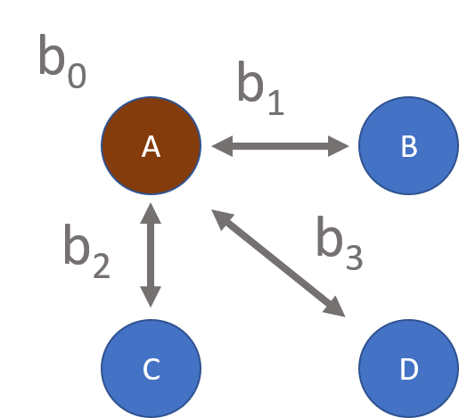

```{r setup, include=FALSE}
knitr::opts_chunk$set(echo=T, fig.width=9, fig.height=6, warning=F, message=F )
```

#### [CPP 523: Program Eval I](https://ds4ps.org/cpp-523-fall-2019/schedule/)

<br>

```{r}
library( stargazer )
library( pander )
library( dplyr )
```


# Case Study

```{r, echo=F}
set.seed( 1234 )

female <- sample( c(0,1), 1000, T )
minority <- sample( c(0,1), 1000, T )
salary <- 90000 + 3000*female + 500*minority + 7000*female*minority + rnorm(1000,0,10000)

male <- 1 - female 
white <- 1 - minority

white.male <- white * male 
white.female <- white * female 
minority.male <- minority * male
minority.female <- minority * female 

sum( white.male + white.female + minority.male + minority.female )

# dat <- data.frame( salary, female, male, minority, white, 
#                    white.male, white.female, minority.male, minority.female,
#                    stringsAsFactors=FALSE )

# write.csv( dat, "data/engineer-salaries.csv", row.names=F )
```


This questions examines hypothetical data used to study the pay gap at Google. First read the news excerpts below:

[**Google gender pay gap: women advance suit that could affect 8,300 workers**](https://www.theguardian.com/technology/2018/oct/26/google-gender-pay-gap-women-class-action-lawsuit)

The Guardian, October 2018

*A group of women who sued Google for pay discrimination are advancing a class-action lawsuit in California that could affect more than 8,000 current and former employees, the plaintiffs’ lawyer said.*

*The civil complaint, filed a year ago, alleged that Google was paying women less than men doing similar work while also denying promotions and career opportunities to qualified women who were “segregated” into lower-paying jobs. The first version of the suit covered all women employed by the company in California over four years, but the company fought the suit and data requests of the plaintiffs, and a judge dismissed the initial case as overly broad.*

*The class action followed a major inquiry by the US Department of Labor (DoL), which said last year that its audit of Google revealed “systemic compensation disparities against women pretty much across the entire workforce”. The allegation came after Google, a federal contractor subject to equal opportunity laws, refused to hand over certain records to the DoL. A judge ultimately ordered Google to disclose certain salary documents to labor investigators.*

*In its 2017 analysis, the company found statistically significant pay difference for 228 employees in six job categories, including men and women in several counties, and “Black and Latinx/Hispanic Googlers in the U.S. across functions.”*


[**Google found it paid men less than women for the same job**](https://techcrunch.com/2019/03/04/google-found-it-paid-men-less-than-women-for-the-same-job/)

Tech Crunch, March 2019 

*The story we’re used to hearing is that women get paid less than men. In Google’s  case, according to its own internal pay audit, it turned out male-identified Level 4 Software Engineers received less money than women in that same role. That led to Google paying $9.7 million to adjust pay for 10,677 employees.*

*It’s not clear how many of the employees who received pay adjustments were men (TechCrunch reached out to Google about this, but the company declined to share any additional data), but Google does cite the underpaying of men as a reason why the company paid more in adjustments for 2018 than in 2017. But The New York Times reports men received a disproportionately higher percentage of the money.*


---

The pay gap is a super interesting and timely program evaluation exercise, but not at all straight-forward. Men and women will often work in different roles in companies (a hospital where most doctors are women, most nurses are men, for example). Thus the comparison of male salaries to female salaries is pretty meaningless. 

As a result, the analysis is typically done by creating buckets for the same positions and comparing salaries within those roles. The comparison of salaries of male and female nurses is much more meaningful. At Google, let's assume that this data all comes from Level 1 engineers (entry level software positions where most people have bachelors degrees). 

As a side note, this is not a perfect fix for estimating the level of discrimination since pay scale within a role does not account for discrimination in promotion across roles:

*Kelly Ellis, a former Google software engineer and plaintiff in the lawsuit, claims she was hired in at Level 3, the category for recent college grads, despite having four years of professional experience. The lawsuit alleges that weeks after Ellis joined the company, Google hired a male engineer with the same experience at Level 4, which translated into a higher salary and potential access to bigger bonuses and more stock.* [cite](https://www.wired.com/story/men-google-paid-less-than-women-not-really/)

But for now, we will ignore those issues! 

The data below represents (hypothetical) analysis of salaries for Level 1 Engineers that all started in the same year. We are using two categorical variables, sex and minority status, to determine if pay gaps exist. 

I have created two identical models by inverting the dummies (female -> male and minority -> white). Use the models to answer the questions about salary descrimination below. 

```{r, results="asis"}
m1 <- lm( salary ~ female + minority + female*minority )
m2 <- lm( salary ~ male + white + male*white )

           
stargazer( m1, m2, type="html", digits=0,
           intercept.bottom = FALSE,
           omit.stat = c("ser","f","rsq","adj.rsq"),
           covariate.labels = c("a0/b0: Constant", 
                                "a1: female", 
                                "a2: minority",
                                "a3: female x minority",
                                "b1: male",
                                "b2: white",
                                "b3: male x white") )

```


### Notes on Interpretation

Just like other regressions, these models represent **conditional means**, or averages conditioned on the level of treatment received. In the caffeine example, we could plug 200mg of caffeine into the equation to estimate the average heart rate for people receiving that level of the drug.

In this case we don't have levels of treatment, we have distinct groups. But the math works out the same. If I want to calculate the value for a specific group I would need to turn dummy variables on and off until I have a configuration that represents the group. For example:

### Model 1 

Intercept | Female Dummy | Minority Dummy | Group 
----------|--------------|----------------|---------  
1 | 0 | 0 | white males 
1 | 1 | 0 | white females 
1 | 0 | 1 | minority males 
1 | 1 | 1 | minority females 

We then plug in these dummy values to the regression equation. 

The average salary for minority males is:

<br>

---

<br>

$\hat{y} = a_0 + a_1 \cdot female + a_2 \cdot minority + a_3 \cdot female \cdot minority$

$\hat{y} = 89,788 + (3,739)(0) + (748)(1) + (6,444)(0)(1) = 90,536$

<br>

---

<br>


The constant always represents the reference group that is constructed from all of the omitted catgories. All other salaries will include that salary as a starting point.

Also note since all salaries are in reference to the omitted group, the reference group determines the hypotheses that are tested in the model. Model 1 allows us to say something about whether salaries for minority males are different than white males since white males is the reference group. The coefficient **a2** in this case represents that hypothesis test. 

We CANNOT, however, say anything about whether minority male salaries are (statistically) different than minority female salaries. Neither of those groups is the reference group, so none of the coefficients are reporting a test of those differences. WE can of course calculate the average salaries for those two groups, and calculate the difference. *We can't, however, say whether that difference is statistically significant.*

This model only allows us to test three contrasts where A represents the omitted group:

 

To test for differences between minority male and minority female salaries one of those groups must be constructed as the reference group. 


Recall that the hypothesis test for salary differences are constructed as follows:

$NULL: wages_{white women} = wages_{white men}$ 

$(a_0 + a_1) = a_0$

$(a_0 + a_1) - a_0 = 0$

$a_1 + a_0 - a_0 = 0$

$a_1 = 0$

So the statistical significance of a1 is the test for salary differences (the null being a1 is zero, i.e. that salary differences are zero). 

Note that you can check your answers below by calculating the group salaries in two ways, one using coefficients from Model 1 and one using coefficients from Model 2. If you are doing the calculations correctly the answers should be identical.

<br>


# Lab Questions 

### Question 1

**What group does the intercept represent in Model 1? What group does the intercept represent in Model 2?**


### Question 2

**What is the average salary of a white male?**


### Question 3  

**What is the average salary of a white female?**


### Question 4

**What is the average salary of a minority female?** 


### Question 5 

**The coefficient a1 is statistically significant. Which hypothesis test does that coefficient represent?**


### Question 6 

**The coefficient a2 is NOT statistically significant. Which hypothesis test does that coefficient represent?**


### Challenge Questions 

You do not have to submit answers for these, but they are useful exercises. 

**Write down a regression that would allow you to test the hypothesis whether minority male salaries are different (statistically) than minority female salaries. Which coefficient would tell you the answer?**

The really hard one:

**What hypothesis does a3 test? If we can calculate a minority female salary from a0 + a1 + a2, why do we even need a3?**


<br>

---

<br>


# Submission Instructions

After you have completed your lab submit via Canvas. Login to the ASU portal at <http://canvas.asu.edu> and navigate to the assignments tab in the course repository. Upload your file to the appropriate lab submission link. You can use an RMD file or an MS Word file for this assingment. 

Remember to name your files according to the convention: **Lab-##-LastName.xxx**


<br>
<br>


