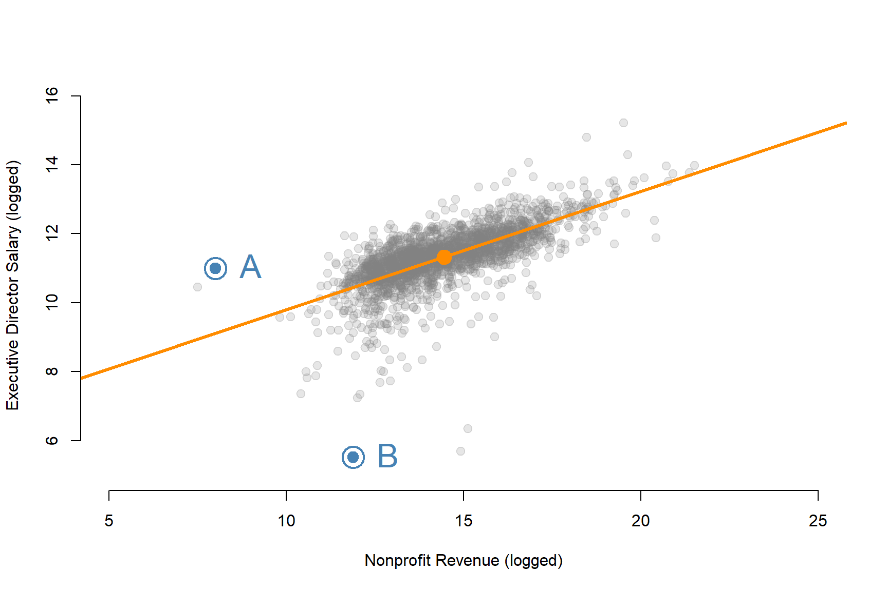

```{r setup, include=FALSE}
knitr::opts_chunk$set(echo=T, fig.width=9, fig.height=6, warning=F, message=F )
```


You will submit your solutions as an RMD document (specifically the HTML file created from the document). You can create a new RMarkdown file, or download the **LAB-06 RMD template**: 

[](https://www.dropbox.com/s/yakecqclo5qd40i/lab-06-template.rmd?dl=1)

<br>


## Study Overview


```{r}
library( dplyr )
library( pander )
library( stargazer )
```


# Part I: Quadratic Models

## Do We Need $75,000 a Year to Be Happy?

_**TIME MAGAZINE**_  
*Monday, Sep. 06, 2010*  
*By Belinda Luscombe*  

People say money doesn't buy happiness. Except, according to a new study from Princeton University's Woodrow Wilson School, it sort of does — up to about \$75,000 a year. The lower a person's annual income falls below that benchmark, the unhappier he or she feels. But no matter how much more than \$75,000 people make, they don't report any greater degree of happiness.

Before employers rush to hold — or raise — everyone's salary to \$75,000, the study points out that there are actually two types of happiness. There's your changeable, day-to-day mood: whether you're stressed or blue or feeling emotionally sound. Then there's the deeper satisfaction you feel about the way your life is going — the kind of thing Tony Robbins tries to teach you. While having an income above the magic \$75,000 cutoff doesn't seem to have an impact on the former (emotional well-being), it definitely improves people's Robbins-like life satisfaction. In other words, the more people make above \$75,000, the more they feel their life is working out on the whole. But it doesn't make them any more jovial in the mornings.

The study, by economist Angus Deaton and psychologist Daniel Kahneman, who has won a Nobel Prize for Economics, analyzed the responses of 450,000 Americans polled by Gallup and Healthways in 2008 and 2009. Participants were asked how they had felt the previous day and whether they were living the best possible life for them. They were also asked about their income.

The authors found that most Americans — 85% — regardless of their annual income, felt happy each day. Almost 40% of respondents also reported feeling stressed (which is not mutually exclusive with happiness) and 24% had feelings of sadness. Most people were also satisfied with the way their life was going.

So, where does the \$75,000 come into play? Researchers found that lower income did not cause sadness itself but made people feel more ground down by the problems they already had. The study found, for example, that among divorced people, about 51% who made less than \$1,000 a month reported feeling sad or stressed the previous day, while only 24% of those earning more than \$3,000 a month reported similar feelings. Among people with asthma, 41% of low earners reported feeling unhappy, compared with about 22% of the wealthier group. Having money clearly takes the sting out of adversities.

At \$75,000, that effect disappears. For people who earn that much or more, individual temperament and life circumstances have much more sway over their lightness of heart than money. The study doesn't say why \$75,000 is the benchmark, but "it does seem to me a plausible number at which people would think money is not an issue," says Deaton. At that level, people probably have enough expendable cash to do things that make them feel good, like going out with friends. (The federal poverty level for a family of four, by the way, is \$22,050.)

But in the bigger view of their lives, people's evaluations were much more tied to their income. The more they made, the more they felt their life was going well. The survey asked respondents to place themselves on a life-satisfaction ladder, with the first rung meaning their lives were not going well and the 10th rung meaning it was as good as it could be. The higher their income, the higher the rung people chose. "Importantly, the same percentage increase in income has the same effect on evaluation for everyone, rich or poor alike, even though the absolute dollar amounts differ," the authors write. So every 10% rise in annual income moves people up the satisfaction ladder the same amount, whether they're making \$25,000 or \$100,000. "High incomes don't bring you happiness, but they do bring you a life you think is better," conclude the authors. Might it be time for Oprah to give these guys their own show?

Past research on money and happiness has also found that it's not absolute wealth that's linked with happiness, but relative wealth or status — that is, how much more money you have than your neighbors.
It's no surprise, then, that when the same polls are done in different countries, Americans come out as a bit of a mixed lot: they're fifth in terms of happiness, 33rd in terms of smiling and 10th in terms of enjoyment. At the same time, they're the 89th biggest worriers, the 69th saddest and fifth most stressed people out of the 151 nations studied. Even so, perhaps because of the country's general wealth, they are in the top 10 citizenries where people feel their lives are going well, beaten out by such eternal optimists as the Canadians, New Zealanders and Scandinavians.

Right. Now that Princeton researchers have untangled that life mystery, maybe someone at MIT can look into the optimal amount of money required to buy us love.


```{r}
URL <- "https://raw.githubusercontent.com/DS4PS/cpp-523-fall-2019/master/labs/data/IncomeHappiness.csv"
dat <- read.csv( URL )
```

```{r, echo=F}
dat$income2 <- dat$income^2
m1 <- lm( happiness ~ income + income2, data=dat )
y_hat <- predict( m1, data.frame( income=1:200000, income2=(1:200000)^2 ) )
```

```{r}
plot( dat$income, dat$happiness, 
      xlab="Income (Thousands of Dollars)", ylab="Hapiness Scale",
      main="Does Money Make You Happy?",
      pch=19, col="darkorange", bty="n",
      xaxt="n" )
axis( side=1, at=c(0,50000,100000,150000,200000), labels=c("$0","$50k","$100k","$150k","$200k") )
lines( 1:200000, y_hat, col=gray(0.3,0.5), lwd=6 )
```


## Questions 

#### Q1. Read the study below, and then use the dataset called “IncomeHappiness.csv” to estimate the following model:

$Happiness = b_0+b_1 Income+ b_2 (Income)^2+e$

Report your results in a regression table.

Helpful advice - since income becomes quite large the coefficient b2 will become quite small. 

```{r}
y.happy <- dat$happiness
x.income <- dat$income 
x2.income.sq <- x.income*x.income
options( scipen=8 )
summary( lm( y.happy ~ x.income + x2.income.sq ) )
```

It's fine, the math will still work out. You just need to report a lot of significant digits in your table. 

You can avoid this issue by scaling income by a constant (dividing by 10,000):

```{r}
# divide income by 10,000
y.happy <- dat$happiness
x.income <- dat$income / 10000  
x2.income.sq <- x.income*x.income
summary( lm( y.happy ~ x.income + x2.income.sq ) )
```

The only change to the slope is it will be 10,000 times larger to offset the incomes that are 10,000 times smaller, thus not changing the interpretation of impact. Standard errors are also scaled by the same amount so that confidence intervals would also stay the same. So the only different is the definition of "one-unit change" in each model. 

In the first case one-unit is one dollar, in the second one-unit is $10k. 


#### Q2. How much happiness do you gain making an extra $10k when your initial income is $15k?

```{r}
b0 <- 1
b1 <- 1
b2 <- 1

x <- 1
happy.15k <- b0 + b1*x + b2*x*x

x <- 2
happy.25k <- b0 + b1*x + b2*x*x

happy.25k - happy.15k  # marginal effect of $10k increase at $15k starting salary
```


#### Q3. How much happiness do you gain making an extra $10k when your initial income is $75k?  

#### Q4. How much happiness do you gain making an extra $10k when your initial income is $100k?  


# Part II: Outliers 


For this part of the final assignment you will be using a dataset that examines compensation of nonprofit executive directors from the years 2012-2013. The data is extracted from the IRS E-Filer database available on AWS. 

```{r}
URL <- "https://github.com/DS4PS/cpp-523-fall-2019/blob/master/labs/data/np-comp-data.rds?raw=true"
dat <- readRDS(gzcon(url( URL )))
set.seed( 1234 )
d2 <- sample_n( dat, 2000 )
```

The full codebook is below for reference. We will use these two variables for the model that predicts nonprofit executive salaries based upon the size of the nonprofit. 

* REVENUE	– Total annual revenue for the nonprofit        
* SALARY 	– Annual salary for the Executive Director  


```{r}
plot( log(d2$REVENUE), log(d2$SALARY), bty="n", pch=19, col="darkorange",
      xlab="Nonprofit Revenue (logged)", ylab="Executive Director Salary (logged)",
      xlim=c(5,25), ylim=c(5,16))
abline( h=seq( 1, 20, 0.5 ), col=gray(0.5,0.2), lwd=1 )
abline( v=seq( 1, 25, 0.5 ), col=gray(0.5,0.2), lwd=1 )
abline( lm( log(d2$SALARY) ~ log(d2$REVENUE) ), col=gray(0.5,0.5), lwd=3 )
```


```{r, eval=F}
plot( log(d2$REVENUE), log(d2$SALARY), bty="n", pch=19, col=gray(0.5,0.2), cex=1.2,
      xlab="Nonprofit Revenue (logged)", ylab="Executive Director Salary (logged)",
      xlim=c(5,25), ylim=c(5,16))

abline( lm( log(d2$SALARY) ~ log(d2$REVENUE) ), col="darkorange", lwd=3 )

points( mean(log(d2$REVENUE)), mean(log(d2$SALARY)), pch=19, col="darkorange", cex=2 )
points( log(d2$REVENUE[c(1446,1681)]), log(d2$SALARY[c(1446,1681)]),
         cex=3, col="steelblue", lwd=2 )
points( log(d2$REVENUE[c(1446,1681)]), log(d2$SALARY[c(1446,1681)]),
         cex=1.5, col="steelblue", pch=19 )
text( log(d2$REVENUE[c(1446,1681)]), log(d2$SALARY[c(1446,1681)]), c("A","B"), 
      pos=4, offset=1.2, col="steelblue", cex=2  )
```




#### Q1. What is the likely impact of the outlier "A" on the regression line?

* Will it make the slope larger or smaller? 
* Would it contribute to a Type I or Type II error? 


#### Q2. What is the likely impact of the outlier "B" on the regression line? 

* Will it make the slope larger or smaller? 
* Would it contribute to a Type I or Type II error? 


#### Q3. The average logged revenue of a nonprofit in this data is 14.44879. What does that translate to in normal dollars? Use the **`exp()`** function. 

*Note there is a decimal after the 14:* `14.44879`


#### Q4. What would be the typical salary for a director of an averaged-size nonprofit (log(14.44879) in revenue a year)? 

$log(Salary) = 6.367 + 0.343 \cdot log(Revenue)$


```{r, results="asis"}
m <- lm( log(SALARY) ~ log(REVENUE), data=d2 )
stargazer( m, type="html",
           omit.stat = c("rsq","f","ser"),
           notes.label = "Standard errors in parentheses" )
```


<br>

#### Q5. Interpret the coefficient b1 (slope for log of revenue) in the model above (i.e. "a one-unit change in X corresponds with a b1-unit change in Y", but adjusted for the log-log context). See the hand-out for guidance. 

[log model handout](https://www.dropbox.com/s/fa81qojmu47xvia/Interpretting-Logged-Regression-Models.pdf?dl=1)  


<br>

---

<br>


Codebook:

* FILEREIN 			– Tax ID of the nonprofit
* TAXYR 			– Year of the tax record (this data is from 2012 and 2013)        
* FILERNAME1 			– Name of the nonprofit
* STATE 			– Location of the nonprofit
* RULEDATE 			– Year and month the nonprofit was granted status  
* NPAGE 			– Nonprofit age                    
* REVENUE 			– Total annual revenue for the nonprofit        
* ASSETS 			– Total assets of the nonprofit           
* PERSONNM			– Name of the Executive Director         
* TITLETXT 			– Title of the Executive Director          
* AVGHRS 			– Average hours worked each week
* SALARY 			– Annual salary for the Executive Director
* GENDER 			– Typical gender for someone with that first name 
* PROPORTION_FEMALE 	– The proportion of babies born with that first name that are female M2012CEO 			– Was there a male executive director in 2012? 1=yes, 0=no  
* TREAT 			– Did the organization hire a new CEO in 2013 with a different gender?
* POST				 – Dummy variable for the second year: 1=2013, 0=2012 
* NTMAJ12 			– Subsector of the nonprofit
  - AR	Arts, culture, and humanities
  - BH	Education, higher
  - ED	Education
  - EH	Hospitals
  - EN	Environment
  - HE	Health
  - HU	Human services
  - IN	International
  - MU	Mutual benefit
  - PU	Public and societal benefit
  - RE	Religion
  - UN	Unknown


<br>

-------

<br>


# Submission Instructions

After you have completed your lab submit via Canvas. Login to the ASU portal at <http://canvas.asu.edu> and navigate to the assignments tab in the course repository. Upload your RMD and your HTML files to the appropriate lab submission link. Or else use the link from the Schedule page. 

Remember to name your files according to the convention: **Lab-##-LastName.xxx**


<br>
<br>


