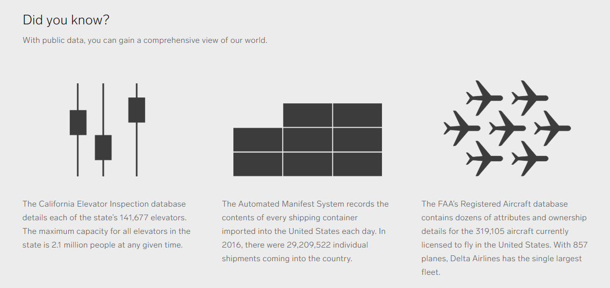

 
<!--- 
New sections start with 2 stars:  ** Section Title
New units start with 3 stars:     *** {Unit Metadata}
-----------------------------start example
** Section-I
*** { @unit = "15th Nov", @title = "Course Overview", @reading, @lecture, @assignment, @foldout }
-----------------------------end example
Unit Metadata is comprised of:
@unit - date or number
@title - unit name
@reading - turn on reading icon
@assignment - turn on lecture icon
@lecture - turn on lecture icon
@foldout - activate unit content (allow foldout)
-->

** Course Schedule

*** { @unit = "", @title = "Course Cadence", @lecture, @foldout }

*** { @unit = "", @title = "Lab Topics", @lecture, @foldout }

## Data Labs

This class highlights two themes:

1. Data is easier to obtain than ever before.
2. Organizations that use data effectively perform better.

So how can we get better at using data? 

**Learning Objectives**: These labs are designed to better understand the process of collecting and utilizing data. The emphasis is on building a strategy to identify high-value data that is most useful for the organization, which requires basic knowledge about data quality. Does the data provide the type of information that is useful for discovery or prediction, and does it measure outcomes precisely?

Advances in computing power, machine learning algorithms, commercial AI platforms, and a robust consulting ecosystem have removed many barriers to building data-driven approach to managerial problems. You can now easily improve existing data collection processes, quickly build low-cost custom applications using open source software, hire analytics firms to help you automate processes or create predictive technologies, or you can train employees to better utilize data that already exists. These tasks do not require you to be the analytical expert, but rather understand just enough about the process to provide leadership in supporting data-driven approaches within the organization.

**Lab 01: Introducing the Case Study**

Many challenges that local governments face arise from changes within the city. Some neighborhoods are in decline, resulting in falling municipal revenues, a rise in demands for services, and new stressors on institutions like schools and public safety. Other neighborhoods are on the rise, creating tensions related to gentrification and demands for different services. And some neighborhoods are experiencing construction booms that require careful management of zoning processes and densification (new pedestrian infrastructure, new forms of transit, changes to small business permits like parking requirements).

The ability to forecast these changes would allow a city to anticipate challenges before they arrive. Accurate forecasting is challenging, though, because it requires a huge amount of data and complex models that have been out of reach of local government employees. These two case studies are examples where researchers have built models using open data and open source software to describe the internal dynamics of neighborhood change and predict which neighborhoods are likely to undergo large transformations.

Learning Outcomes: These cases provide context for exercises in Lab 03 and Lab 04 that examine the data inputs needed to build predictive models. They provide concrete examples of machine learning approaches to data-driven management in the public sector.

**Lab 02: Measurement**

Often times in the public and nonprofit sector the things we care most about can be the hardest to measure. Fortunately, we have a century of psychometrics and measurement theory to build upon. Lab 02 covers basic ideas of measurement by walking you through the process of creating survey instruments or indices to measure things that cannot be directly observed such as happiness, health, intelligence, and personality.

Learning Outcome: The goal is to teach you how to search for existing instruments related to your program so that you are getting more accurate measures and that you are not reinventing the wheel.

**Lab 03 – Feature Selection**

If we want to discover new drivers of organizational performance or make predictions about which strategies will yield the best results, we need to identify the data that is best suited to the particular task. As the beginning of most projects, however, we rarely know which factors will be the biggest drivers of outcomes.

For example, which school characteristics best predict student performance? Is it the facilities and technology? The level of funding? Classroom sizes? Training and support provided to teachers? Parent involvement? Peer networks? All of these are plausible drivers of student performance – the most important factors are rarely self-evident in advance of having data to test them all.

&quot;Feature selection&quot; is data science speak for generating a set of hypotheses and measures about what generates the outcome of interest. In many cases, feature selection is an iterative process of generating hypotheses then determining how to find or collect data to test them. Feature selection requires critical thinking and creativity more than technical expertise, but is a core component of any successful data science project.

In this lab, we will examine how Zillow uses data to predict home values before houses are listed for sale. These models are extremely accurate on average: the median national error rate is under 4%, meaning that more than half of their predictions about home values are within 4% of true selling prices1.  They are becoming so accurate that Zillow is experimenting with a new service of buying homes based upon their estimates and re-selling them on their platform without realtors ever being involved in order to fix inefficiencies in real estate markets.

How does Zillow do this? Which variables or features are the best predictors of home values? If we wanted to improve their models by adding new data, which features or homes and neighborhoods would we use?

Learning Outcome: any new data-driven initiative involves a learning curve. Selecting better features will result in better data and more robust models. Your data experts will not be domain experts, so they are not always good at identifying useful features. The best approach is often to assemble people close to the problem, brainstorm a large list of features, collect test data, and see what is working before you encode your data collection process in an enterprise platform that the organization will use for decades. More learning occurs during this phase of the project than any other.

**Lab 04 – Feature Engineering**

If you had transcripts from 10,000 speed dates, how accurately could you predict whether the couples will go out again? The psychologist, James Pennebaker, has spent his career learning what we can predict by the way people use words. He has developed a process where he is better able to guess whether a second date will occur than the individuals themselves2.  He can also tell you if a person is lying, if they are speaking to a superior or subordinate, and whether they are rich or poor.

The surprising insight from Pennebaker&#39;s work is that a person&#39;s vocabulary or the subjects they choose to discuss do not tell you as much about their inner workings as the pronouns, propositions, and conjunctions. Our brains are so focused on content words and adjectives that we barely here these parts of speech, but they are better at predicting our behavior that the substantive words in our sentences.

Feature engineering describes how we process raw data while preparing it for analysis. If the transcript of a conversation is the data for your model, then features would be things like the size of a person&#39;s vocabulary. How long are sentences, on average? How often do they speak in passive voice? Do they use a specific word or phrase? If we input just the raw text into a model, it would perform poorly. If we &quot;engineer&quot; these specific features from the text, then the models perform much better.

Features are &quot;selected&quot; when we identify specific variables or measures we would like to use. They are &quot;engineered&quot; when we transform the raw data into something more meaningful. The median value of homes within a neighborhood might not predict whether change is eminent, but values standardized by the median value of homes in the entire city – their value relative to other options in the city – will be much more informative. For Pennebaker, his insights came teaching computers to identify parts of speech so that he could count pronouns.

Learning Outcome: Raw data becomes more valuable when meaningful features are engineered. Good data scientists will always look for new ways to use existing data by refining it, merging it, or transforming it into new measures.

[https://www.washingtonpost.com/realestate/which-firm-has-more-accurate-online-estimates-for-homes-zillow-or-redfin/2019/02/19/7a1f6436-346b-11e9-a400-e481bf264fdc\_story.html](https://www.washingtonpost.com/realestate/which-firm-has-more-accurate-online-estimates-for-homes-zillow-or-redfin/2019/02/19/7a1f6436-346b-11e9-a400-e481bf264fdc_story.html?utm_term=.467073346b2a)

[https://www.npr.org/sections/health-shots/2012/04/30/151550273/to-predict-dating-success-the-secrets-in-the-pronouns](https://www.npr.org/sections/health-shots/2012/04/30/151550273/to-predict-dating-success-the-secrets-in-the-pronouns)

** Lab Solutions

*** { @unit = "", @title = "Lab 01", @assignment, @foldout }

<a class="uk-button uk-button-default" href="https://github.com/DS4PS/paf-586-summer-2019/raw/master/labs/lab-01-solutions.pdf">Lab 01 SOLUTION</a>

*** { @unit = "", @title = "Lab 02", @assignment, @foldout }

<a class="uk-button uk-button-default" href="https://github.com/DS4PS/paf-586-summer-2019/raw/master/labs/lab-02-solutions.pdf">Lab 02 SOLUTION</a>

*** { @unit = "", @title = "Lab 03", @assignment, @foldout }

<a class="uk-button uk-button-default" href="https://github.com/DS4PS/paf-586-summer-2019/raw/master/labs/lab-03-solutions.pdf">Lab 03 SOLUTION</a>

** Week 1 - The Promise of Data

*** { @unit = "", @title = "Course Overview", @lecture, @foldout }

## KEY COURSE THEMES

### The Promise of Big Data: 

In 2017 The Economist declared, "Data is to this century what oil was to the last one: a driver of growth and change. Flows of data have created new infrastructure, new businesses, new monopolies, new politics and – crucially – new economics."

In 2011 McKinsey & Co. described big data as "the next frontier for innovation, competition, and productivity.” 
GE looked to big data to drive "changes as profound as industrialization... in the late 1700s".

### [Challenges of Harnessing Data]( https://sloanreview.mit.edu/case-study/lessons-from-becoming-a-data-driven-organization/):

Many organizations have been slow in compiling, classifying, and organizing the data sitting in siloes and dark corners. It’s “a boring, boring job,” says Ger Baron, Amsterdam’s first-ever chief technology officer. “But very useful!” 

He ought to know. The Netherlands’ capital has 12,000 different datasets, and even they can’t tell him everything about the city. For example, no one knows exactly how many bridges span Amsterdam’s famous canals, because the city’s individual districts have not centralized their infrastructure data.

That story underscores the challenges organizations face in the realm of data governance, or the methods and rules that organizations use to assure the quality of data, manage it, integrate it into business processes, and manage its risks.

### [Abundant Data by Itself Solves Nothing](https://graymattersystems.com/cio-survey-reveals-challenges-opportunities-potential-industrial-big-data/ ):  

Despite the promise of big data, industrial enterprises are struggling to maximize its value. Why? Abundant data by itself solves nothing. Its unstructured nature, sheer volume, and variety exceed human capacity and traditional tools to organize it efficiently and at a cost which supports return on investment requirements. Inherent challenges tied to evolution and integration of industrial information and operational technology, make it difficult to glean intelligence from operational data, compromising projects underway and promise for further investment and value. 

### [Firms are years away from getting full value from their data assets](https://www.theregister.co.uk/2017/06/07/go_small_on_big_data/):  

Throwing cash at the problem isn't helping matters either. Companies need to scale back their ambitions to invest in projects that are more evolutionary than revolutionary in nature, looking to tweak rather than overhaul existing operational practices. In short, the best big data strategy may be to go small.

### [Effective Approaches](https://sloanreview.mit.edu/case-study/lessons-from-becoming-a-data-driven-organization/ ): 

It’s tough enough for many organizations to catalog and categorize the data at their disposal and devise the rules and processes for using it. It’s even tougher to translate that data into tangible value.

There would be no data and analytics revolution without easily accessible, increasingly inexpensive computing power: the cloud, the Internet, and powerful, versatile software and algorithms. Yet technology is only part of the story. People are equally important.

The technology and the people who deploy it also need a process or system of rules to guide how people create and use information. Rules help transform the noise of disordered information into legible signals with the power to sharpen and deepen the focus on the customer (broadly defined), and in the process improve health outcomes, the customer experience, the realization of business value, and civic life and engagement.

### [The Age of Big Data: New York Times](https://www.nytimes.com/2012/02/12/sunday-review/big-datas-impact-in-the-world.html) 

A report last year by the McKinsey Global Institute, the research arm of the consulting firm, projected that the United States needs 140,000 to 190,000 more workers with “deep analytical” expertise and 1.5 million more data-literate managers, whether retrained or hired.

 
 

*** { @unit = "", @title = "The Value of Data", @reading, @foldout }

# The Value of Data

* Lewis, M. (2018). The Fifth Risk. WW Norton & Company. **CH5: all the president’s data pp 179-188** [ [PDF](https://github.com/DS4PS/paf-586-summer-2019/raw/master/Reading/fifth-risk-CH5-all-the-presidents-data.pdf) ] 

*How much did Friedberg pay for the NOAA weather data? How much did his company sell for? What is the economic value of government data?*

 

 
 

*** { @unit = "Due July 7th", @title = "Open Data (Team 1)", @reading, @foldout }

# Open Data

* Eagle, N., & Greene, K. (2014). Reality mining: Using big data to engineer a better world. MIT Press. **CH7 mobile and internet data**
* Lewis, M. (2018). The Fifth Risk. WW Norton & Company. **CH5: data as a public good pp 148-179** [ [PDF](https://github.com/DS4PS/paf-586-summer-2019/raw/master/Reading/fifth-risk-CH5-all-the-presidents-data.pdf) ] 

The value of public data will often be unlocked by private individuals or firms. What is the difference between Friedberg’s use of NOAA data and AcuWeather’s use of the data? 

[Instructions for Posting Summaries](http://ds4ps.org/ddm-textbook-summer-2019/instructions/)

 
 

*** { @unit = "", @title = "The Big Promise of Big Data (Team 2)", @reading, @foldout }

# The Big Promise of Big Data

* Pentland, A. (2015). Social Physics: How social networks can make us smarter. Penguin. **CH1**
* Meier, P. (2015). Digital humanitarians: how big data is changing the face of humanitarian response. Routledge. **CH1**

[Instructions for Posting Summaries](http://ds4ps.org/ddm-textbook-summer-2019/instructions/)

 
 

*** { @unit = "", @title = "Challenges of Big Data (Team 3)", @reading, @foldout }

# Challenges of Big Data (Team 3)

* O'Neil, C. (2016). Weapons of math destruction: How big data increases inequality and threatens democracy. Broadway Books. **Introduction pp 1-13**  
* [Desouza, K. C., & Smith, K. L. (2014). Big data for social innovation. Stanford Social Innovation Review, 2014, 39-43.](https://ssir.org/articles/entry/big_data_for_social_innovation#)  
* Duhigg, C. (2016). Smarter faster better: The secrets of being productive. Random House. [**CH8 pp 238-247, 252-267**](https://github.com/DS4PS/paf-586-summer-2019/raw/master/Reading/duhigg-smarter-faster-better-CH8-info-blindness.pdf)  

[Instructions for Posting Summaries](http://ds4ps.org/ddm-textbook-summer-2019/instructions/)

 
 

*** { @unit = "Due July 9th", @title = "LAB 1: Models of Neighborhood Change", @assignment, @foldout }

# Week 1 Lab

This week’s lab will introduce you to two data-driven models of neighborhood change. We will use this case study over the next six weeks to discuss things like data needs for predictive models. You will be required to think critically about the data used in the labs, but you will not be responsible for things like the advanced analytical models in the paper. I am approaching the labs with the assumption that you are likely to be a manager hiring an analyst, so you need a high-level understanding of the models in order to find someone for the task.

Neighborhood change is a complicated concept with a lot of loaded terminology. We might think about neighborhoods that are "revitalized", "gentrified", that are "stable", or that "decline".  We could spend an entire semester unpacking all of these constructs, but that is out of scope of the lab. Here we are more interested in how we might make sense of our data, and then once we have meaningful groups how we might use them to make predictions with the data. Can a city forecast how it's current neighborhoods are likely to change over the next decade, and can that help with urban planning processes? 

Read the following articles:

> Market Value Analysis: A Data-Based Approach to Understanding Urban Housing Markets. pp 49-59 [ [PDF](https://github.com/DS4PS/paf-586-summer-2019/raw/master/Reading/MVA-DD-App-to-Strengthening-Neighborhoods.pdf) ]

> Delmelle, E. C. (2017). Differentiating pathways of neighborhood change in 50 US metropolitan areas. Environment and planning A, 49(10), 2402-2424. [ [PDF](https://github.com/DS4PS/paf-586-summer-2019/raw/master/Reading/differentiating-pathways-of-neighborhood-change.pdf) ]

We are interesting in understanding neighborhood change. These data-driven approaches to the phenomenon use machine-learning algorithms to "discover" coherent communities within the city by grouping census tracks into groups that minimize within-group differences and maximize between-group differences. 

You can explore one of these algorithms by looking at examples of how botanists might create "species" based upon characteristics of flowers:

[Clustering Example](https://shiny.rstudio.com/gallery/kmeans-example.html)

A data-driven approach to understanding neighborhood change requires use to (1) define "neighborhoods", or groups of census tracks in the data that are very similar, and (2) use those group characteristics at a point in time to predict how they "neighborhood" might change in the future. Both of the papers present variations on Step (1) above.

Read the two papers, then answer the following questions:

1. **How did each author identify coherent “neighborhoods” (or groups) in each model?**
2. **Would these "neighborhoods" line up with neighborhoods that are defined on a city's zoning maps (Links to an external site.)?**
3. **Did the two models use the same data to create the groups?**
4. **How do the labels and descriptions of the groups differ in each model and why?**

Write your responses in a word document, save your responses as a PDF and name your file LAB-01-YOUR-LAST-NAME.pdf, then submit it via the Canvas assignment tool. 

Concise and precise answers are preferred to meandering paragraphs! One page would be fine for this assignment. 

Submit your lab through the [Canvas Shell](https://asu.instructure.com/courses/26991/assignments/572663).

** Week 2 - Collecting Data

*** { @unit = "Due July 14th", @title = "Data on Teams (Team 4)", @reading, @foldout }

## Data on Teams (Team 4)
*	Pentland, A. (2015). Social Physics: How social networks can make us smarter. Penguin. **CH5 observing people in organizations**
*	Eagle, N., & Greene, K. (2014). Reality mining: Using big data to engineer a better world. MIT Press. **CH3 gathering group data**

[Instructions for Posting Summaries](http://ds4ps.org/ddm-textbook-summer-2019/instructions/)

 
 

*** { @unit = "", @title = "Eyes in the Sky (Team 5)", @reading, @foldout }

## Eyes in the Sky (Team 5)

*	Meier, P. (2015). Digital humanitarians: how big data is changing the face of humanitarian response. Routledge. **CH4 crowd computing satellite and aerial images**  
*	Meier, P. (2015). Digital humanitarians: how big data is changing the face of humanitarian response. Routledge. **CH6 artificial intelligence in the sky**  
*	Radiolab Podcast: [Eye in the Sky](https://www.wnycstudios.org/story/eye-sky)   
* [Washington Post on the Eye in the Sky](https://www.washingtonpost.com/business/technology/new-surveillance-technology-can-track-everyone-in-an-area-for-several-hours-at-a-time/2014/02/05/82f1556e-876f-11e3-a5bd-844629433ba3_story.html) 

[Instructions for Posting Summaries](http://ds4ps.org/ddm-textbook-summer-2019/instructions/)

 
 

*** { @unit = "", @title = "Social Media Data (Team 1)", @reading, @foldout }

## Social Media Data (Team 1)

*	Meier, P. (2015). Digital humanitarians: how big data is changing the face of humanitarian response. Routledge. **CH3 crowd computing social media**
*	Meier, P. (2015). Digital humanitarians: how big data is changing the face of humanitarian response. Routledge. **CH5 artificial intelligence for disaster response**

 
 

*** { @unit = "", @title = "Remote Sensors (Team 2)", @reading, @foldout }

## Remote Sensors (Team 2)

*	Eagle, N., & Greene, K. (2014). Reality mining: Using big data to engineer a better world. MIT Press. **CH5 urban analytics: traffic data, crime stats, and closed-circuit cameras**
*	Pentland, A. (2015). Social Physics: How social networks can make us smarter. Penguin. **CH8 sensing cities**

 
 

*** { @unit = "Due July 19th", @title = "LAB 2 - Measurement and Reliability", @assignment, @foldout }

# Lab 02 - Measurement and Reliability 

Not all data is create equal. This lab demonstrates how to identify appropriate survey instruments when you need to measure program impact or key performance indicators on outcomes that cannot be directly observed (for example, health or happiness). In Part I you will create a new index from a set of survey questions by keeping the questions that generate a high score on a reliability measure to ensure your instrument will create stable measures. Part II illustrates how to conduct research to assess whether an existing index will generate reliable data. 

**Learning objective**: Become a better consumer of data by understanding the difference between reliable and unreliable scales. Become a better data-driven manager by seeking out instruments that have been properly validated and provide means for interpreting results (population benchmarks).  

# Part I: Create a Reliable Index

Part I of the lab is designed to familiarize you with the concept of data **reliability** by constructing an index from a set of survey questions. The reliability of an index describes how consistently it will measure the outcome.

An index is a **scale** , which provides a useful metaphor for understanding reliability. An accurate scale that measures your weight will report the same number if you step on it and off several times in a row. If the scale it reports wildly different weights each time you step on it then it is unreliable. Similarly, if an index generates a good scale it should reliably measure the level of the construct you are trying to observe.

The reliability of an index is measured by calculating a Cronbach's Alpha score, a statistic that varies from 0 (data that is all noise) to 1 (an index that measures the outcome very precisely). By convention, an index must have a Cronbach's Alpha measure above 0.6 to be considered reliable, and above 0.8 it is considered highly-reliable. All of the survey questions on a well-designed index produce highly-correlated responses since they are meant to measure the same construct. They higher the correlations, the higher the Cronbach's Alpha score.

Your task on this assignment is to design an index that measures Community Well-Being. You must select **5 variables** from a list of 30 candidate variables to create your index. It must have a Cronbach's Alpha score of at least 0.6. The Cronbach's Alpha score is calculated for you based upon the variables you have selected. You have also been provided with a warm-up exercise for practice. 

The app for Part I can be found here:

[https://jdlecy.shinyapps.io/measurement-lab/#section-warmup](https://jdlecy.shinyapps.io/measurement-lab/#section-warmup)

**Instructions:**

Use the Census Data on the "Index Design"tab to complete this part of the assignment.

Your task is to create a reliable index of  **Community Well-Being**. A community is healthy if we expect citizens to achieve a good quality of life and economic stability while living there.

You can approach the task by constructing and index where a high score on the scale would indicate well-being. Alternatively, you can identify items that measure the absence of well-being (the high and low ends of the scale can easily be reversed). Either way, you should seek to create a reliable index - one that has a high Cronbach's Alpha score (at the very least above a 0.6).

**STEP 1:**

Select the five variables you would like to use for your **Community Well-Being Index**. The selected variables must generate a Cronbach&#39;s Alpha of _AT LEAST_ a 0.6 in order to be reliable. Report which variables you have selected, and the alpha you have achieved.

**STEP 2:**

Take a screen shot of the correlation structure and alpha score for these variables. Include the screenshot in your report.

**STEP 3:**

Describe the latent construct that you believe you are measuring. Do you think your variables are a good measure of community well-being, or are they measuring a specific dimension of strength or something else completely?

For example, IQ and creativity are both dimensions of intelligence. They are typically measured using very different types of tests (indices). When creating a new index it is helpful to be clear about what you believe the measure represents.

**WHAT TO SUBMIT**

1. Record your findings in the same document as Part II of the assignment. Submit via Canvas.
1. Create a Yellowdig post with (1) your list of variables, (2) your interpretation of what the index measures, and (3) a screen shot of your correlation matrix and Cronbach's Alpha score.

The person who creates the most reliable community index (highest Cronbach's Alpha score) will get 5 bonus points.

# Part II

Select one of the following instruments to review:

- [SF-36 Measure of Health](https://www.healthknowledge.org.uk/public-health-textbook/research-methods/1c-health-care-evaluation-health-care-assessment/measures-health-status) [ [questions](https://www.brandeis.edu/roybal/docs/SF-36_website_PDF.pdf) ] [ [benchmarks pp 3135-3136](https://www.dropbox.com/s/318rw6obrc3gne4/SF-36-Health-Survey-Update.pdf?dl=1) ] 
- [Oxford Happiness Index](http://content.time.com/time/magazine/article/0,9171,1015832,00.html) [ [questions & benchmarks](http://www.blake-group.com/sites/default/files/assessments/Oxford_Happiness_Questionnaire.pdf) ] [ [reliability](http://www.louisianaparadox.com/wp-content/uploads/2011/01/Hills-Argyle-2002.pdf) ] 
- [Grit (Duckworth index)](http://freakonomics.com/podcast/grit/) [ [questions](https://angeladuckworth.com/grit-scale/) ] [ [benchmarks & reliability](https://www.dropbox.com/s/0y545gn2withb5e/DuckworthPetersonMatthewsKelly_2007_PerseveranceandPassion.pdf?dl=0) ] 
- [The Big Five (personality index)](https://www.psychologytoday.com/us/blog/give-and-take/201309/goodbye-mbti-the-fad-won-t-die) [ [questions & benchmarks](https://openpsychometrics.org/tests/IPIP-BFFM/) ] [ [scoring](https://ipip.ori.org/new_ipip-50-item-scale.htm) ] 

Answer the following questions about your instrument. Use Google or Google Scholar (for academic references) to find information about your instrument as needed.

1. What is the latent construct that your instrument measures? Provide a precise definition of the construct.
1. Explain the instrument that has been developed to measure the construct. How many items does it use? How are responses reported (e.g yes/no, Likert scale, or otherwise).
1. Report a Cronbach's alpha score of your instrument (or another reliability measure) that has been published in a legitimate academic outlet. Report the article citation and include the article with your submission.
1. Is this instrument appropriate for high-stakes performance reviews? For example, if your health improves you receive a discount on your insurance premiums. Or phrased another way, can someone manipulate their responses to get a high score? The LSAT is an example where someone can NOT game their responses to score higher. On surveys, however, people tend to over-estimate their height and under-report their income.
1. OPTIONAL: Complete the survey and calculate your score on the index. How do you know if your score is high or low (i.e. what is the average response from the general population)? Where does this index benchmark come from?

The following chapter is available as a reference:

Kimberlin, C. L., & Winterstein, A. G. (2008). 'Validity and Reliability of Measurement Instruments Used in Research.' Am J Health Syst Pharm, 65(23), 2276-84. [ [PDF](https://www.dropbox.com/s/1ibqoq2yv5egtol/Reliabillity-and-Validity-of-Measures.pdf?dl=1) ]

<a class="uk-button uk-button-default" href="https://asu.instructure.com/courses/26991/assignments/581818">SUBMIT YOUR ASSIGNMENT</a>

** Week 3 - Prediction  

*** { @unit = "Due July 21st", @title = "Discovery (Team 3)", @reading, @foldout }

## Discovery (Team 3)

* Pentland, A. (2015). Social Physics: How social networks can make us smarter. Penguin. **CH2 exploration**
* Eagle, N., & Greene, K. (2014). Reality mining: Using big data to engineer a better world. MIT Press. **CH8 economic deficits and disasters**
* Select three blog posts from [I Quant NY](http://iquantny.tumblr.com/) and **describe some discoveries that have come from open data in NYC**  

 
 

*** { @unit = "", @title = "Playing Moneyball (Team 4)", @reading, @foldout }

## Prediction  (Team 4)

* Eagle, N., & Greene, K. (2014). Reality mining: Using big data to engineer a better world. MIT Press. **CH6 optimizing resource allocation**
* Eagle, N., & Greene, K. (2014). Reality mining: Using big data to engineer a better world. MIT Press. **CH10 engineering a safer and healthier world**

 
 

*** { @unit = "", @title = "Bias in Prediction (Team 5)", @reading, @foldout }

## Bias in Prediction (Team 5)

* O'Neil, C. (2016). Weapons of math destruction: How big data increases inequality and threatens democracy. Broadway Books. **CH1 bomb parts**
* O'Neil, C. (2016). Weapons of math destruction: How big data increases inequality and threatens democracy. Broadway Books. **CH5 justice in an era of big data**
* O'Neil, C. (2016). Weapons of math destruction: How big data increases inequality and threatens democracy. Broadway Books. **CH8 landing credit**

 
 

*** { @unit = "Due July 23rd", @title = "LAB 3 - Feature Selection", @assignment, @foldout }

Lab 03 is available here:

<a class="uk-button uk-button-default" href="https://ds4ps.org/paf-586-summer-2019/lab-03-feature-selection/">LAB 03 Feature Selection</a>

When ready, you can submit your lab via Canvas:

<a class="uk-button uk-button-default" href="https://canvas.asu.edu/courses/26991/assignments/588320">Submit Lab 03</a>

-----

## Preview

This lab covers "feature selection", the process of selecting variables you believe to be strong predictors of your outcome. In public policy feature selection can be a grueling process of testing lots of theories until you come up with a consistent story about what works. 

One of the biggest challanges in guessing which data will be useful ahead of time is that the brain is designed to tell stories, not to test the strength of theories (humans are bad at assessing probabilities of events occuring). When we are presented with a new variable our brains immediately start to invent stories of why it could explain the outcome. A well-known human bias is that the easier it is for us to invent a story, the more likely we are to believe it is true (lacking any evidence). 

You don't believe me? Well give it a try. The table below contains the 57 variables that Zillow uses for it's Zestimate model that predicts the market value of a home. Can you guess which three variables will most strongly predict the home value? 

| Feature         | Description    |
|:----------------|:----------------------------|
| **airconditioningtypeid**        |  Type of cooling system present in the home (if any)                                                                   |
| **architecturalstyletypeid**     |  Architectural style of the home (i.e. ranch, colonial, split-level, etc…)                                             |
| **basementsqft**                 |  Finished living area below or partially below ground level                                                            |
| **bathroomcnt**                  |  Number of bathrooms in home including fractional bathrooms                                                            |
| **bedroomcnt**                   |  Number of bedrooms in home                                                                                            |
| **buildingqualitytypeid**        |  Overall assessment of condition of the building from best (lowest) to worst (highest)                                 |
| **buildingclasstypeid**          | The building framing type (steel frame, wood frame, concrete/brick)                                                    |
| **calculatedbathnbr**            |  Number of bathrooms in home including fractional bathroom                                                             |
| **decktypeid**                   | Type of deck (if any) present on parcel                                                                                |
| **threequarterbathnbr**          |  Number of 3/4 bathrooms in house (shower + sink + toilet)                                                             |
| **finishedfloor1squarefeet**     |  Size of the finished living area on the first (entry) floor of the home                                               |
| **calculatedfinishedsquarefeet** |  Calculated total finished living area of the home                                                                     |
| **finishedsquarefeet6**          | Base unfinished and finished area                                                                                      |
| **finishedsquarefeet12**         | Finished living area                                                                                                   |
| **finishedsquarefeet13**         | Perimeter  living area                                                                                                 |
| **finishedsquarefeet15**         | Total area                                                                                                             |
| **finishedsquarefeet50**         |  Size of the finished living area on the first (entry) floor of the home                                               |
| **fips**                         |  Federal Information Processing Standard code -  see https://en.wikipedia.org/wiki/FIPS_county_code for more details   |
| **fireplacecnt**                 |  Number of fireplaces in a home (if any)                                                                               |
| **fireplaceflag**                |  Is a fireplace present in this home                                                                                   |
| **fullbathcnt**                  |  Number of full bathrooms (sink, shower + bathtub, and toilet) present in home                                         |
| **garagecarcnt**                 |  Total number of garages on the lot including an attached garage                                                       |
| **garagetotalsqft**              |  Total number of square feet of all garages on lot including an attached garage                                        |
| **hashottuborspa**               |  Does the home have a hot tub or spa                                                                                   |
| **heatingorsystemtypeid**        |  Type of home heating system                                                                                           |
| **latitude**                     |  Latitude of the middle of the parcel multiplied by 10e6                                                               |
| **longitude**                    |  Longitude of the middle of the parcel multiplied by 10e6                                                              |
| **lotsizesquarefeet**            |  Area of the lot in square feet                                                                                        |
| **numberofstories**              |  Number of stories or levels the home has                                                                              |
| **parcelid**                     |  Unique identifier for parcels (lots)                                                                                  |
| **poolcnt**                      |  Number of pools on the lot (if any)                                                                                   |
| **poolsizesum**                  |  Total square footage of all pools on property                                                                         |
| **pooltypeid10**                 |  Spa or Hot Tub                                                                                                        |
| **pooltypeid2**                  |  Pool with Spa/Hot Tub                                                                                                 |
| **pooltypeid7**                  |  Pool without hot tub                                                                                                  |
| **propertycountylandusecode**    |  County land use code i.e. it's zoning at the county level                                                             |
| **propertylandusetypeid**        |  Type of land use the property is zoned for                                                                            |
| **propertyzoningdesc**           |  Description of the allowed land uses (zoning) for that property                                                       |
| **rawcensustractandblock**       |  Census tract and block ID combined - also contains blockgroup assignment by extension                                 |
| **censustractandblock**          |  Census tract and block ID combined - also contains blockgroup assignment by extension                                 |
| **regionidcounty**               | County in which the property is located                                                                                |
| **regionidcity**                 |  City in which the property is located (if any)                                                                        |
| **regionidzip**                  |  Zip code in which the property is located                                                                             |
| **regionidneighborhood**         | Neighborhood in which the property is located                                                                          |
| **roomcnt**                      |  Total number of rooms in the principal residence                                                                      |
| **storytypeid**                  |  Type of floors in a multi-story house (i.e. basement and main level, split-level, attic, etc.).  See tab for details. |
| **typeconstructiontypeid**       |  What type of construction material was used to construct the home                                                     |
| **unitcnt**                      |  Number of units the structure is built into (i.e. 2 = duplex, 3 = triplex, etc...)                                    |
| **yardbuildingsqft17**           | Patio in  yard                                                                                                         |
| **yardbuildingsqft26**           | Storage shed/building in yard                                                                                          |
| **yearbuilt**                    |  The Year the principal residence was built                                                                            |
| **taxvaluedollarcnt**            | The total tax assessed value of the parcel                                                                             |
| **structuretaxvaluedollarcnt**   | The assessed value of the built structure on the parcel                                                                |
| **landtaxvaluedollarcnt**        | The assessed value of the land area of the parcel                                                                      |
| **taxamount**                    | The total property tax assessed for that assessment year                                                               |
| **assessmentyear**               | The year of the property tax assessment                                                                                |
| **taxdelinquencyflag**           | Property taxes for this parcel are past due as of 2015                                                                 |
| **taxdelinquencyyear**           | Year for which the unpaid propert taxes were due    |

** Week 4 - Challenges of Big Data

*** { @unit = "", @title = "Machine Learning for Everyone", @reading, @foldout }

These readings represent a few simple overviews of machine learning and artificial intelligence articles if you are interested in diving into some details of the methods described in chapters from the books.

[Machine Learning for Everyone](https://vas3k.com/blog/machine_learning/)

[Machine Learning for Humans](https://medium.com/machine-learning-for-humans/why-machine-learning-matters-6164faf1df12)

Automated Feature Engineering: [OVERVIEW](https://towardsdatascience.com/why-automated-feature-engineering-will-change-the-way-you-do-machine-learning-5c15bf188b96) [DETAILS](https://blog.featurelabs.com/deep-feature-synthesis/)

[27 Examples of AI in Practice](https://www.forbes.com/sites/bernardmarr/2018/04/30/27-incredible-examples-of-ai-and-machine-learning-in-practice/#36e5584e7502)

[15 Ways AI Will Impact Your Life](https://elitedatascience.com/machine-learning-impact)

*** { @unit = "Due July 28th", @title = "Data Quality (Team 1)", @reading, @foldout }

1.	Meier, P. (2015). Digital humanitarians: how big data is changing the face of humanitarian response. Routledge. **CH2 the rise of big crisis data pp 31-47**
2.	Meier, P. (2015). Digital humanitarians: how big data is changing the face of humanitarian response. Routledge. **CH7 verifying big crisis data via crowd computing**
3.	Meier, P. (2015). Digital humanitarians: how big data is changing the face of humanitarian response. Routledge. **CH8 verifying big crisis data via artificial intelligence** 

*** { @unit = "", @title = "Manipulation (Team 2)", @reading, @foldout }

1.	O'Neil, C. (2016). Weapons of math destruction: How big data increases inequality and threatens democracy. Broadway Books. **CH4 propaganda machine**
2.	O'Neil, C. (2016). Weapons of math destruction: How big data increases inequality and threatens democracy. Broadway Books. **CH10 targeting citizens**

*** { @unit = "", @title = "Ethics of Algorithms (Team 3)", @reading, @foldout }

1.	O'Neil, C. (2016). Weapons of math destruction: How big data increases inequality and threatens democracy. Broadway Books. **CH9 getting insurance**
2.	O'Neil, C. (2016). Weapons of math destruction: How big data increases inequality and threatens democracy. Broadway Books. **conclusion**

*** { @unit = "", @title = "Best Practices for Privacy (Team 4)", @reading, @foldout }

1.	Pentland, A. (2015). Social Physics: How social networks can make us smarter. Penguin. **CH10 data-driven societies, Appendix 2 openPDS**
2.	Eagle, N., & Greene, K. (2014). Reality mining: Using big data to engineer a better world. MIT Press. **CH2 using personal data in a privacy-sensitive way**
3.	Everything you need to know about the EU’s new privacy law GDPR: https://www.theverge.com/2018/3/28/17172548/gdpr-compliance-requirements-privacy-notice

*** { @unit = "Due August 2nd", @title = "LAB 4 - Feature Engineering", @assignment, @foldout }

Lab 04 is available here:

<a class="uk-button uk-button-default" href="https://ds4ps.org/paf-586-summer-2019/lab-04-feature-engineering/">LAB 04 Feature Engineering</a>

When ready, you can submit your lab via Canvas:

<a class="uk-button uk-button-default" href="https://canvas.asu.edu/courses/26991/assignments/603690">Submit Lab 04</a>

** Week 5 - Managing with Data 

*** { @unit = "Due Aug 4th", @title = "Managerial Experiments (Team 5)", @reading, @foldout }

1.	Duhigg, C. (2016). Smarter faster better: The secrets of being productive. Random House. **CH8 Charlotte Fludd pp 247-252, the data room 252-256**
2.	BBC World Service: “How Iceland Saved Its Teenagers” November 11, 2017. [ [article](https://www.theatlantic.com/health/archive/2017/01/teens-drugs-iceland/513668/) ] [ [bonus podcast]() ]
3.	Eagle, N., & Greene, K. (2014). Reality mining: Using big data to engineer a better world. MIT Press. **CH4 engineering public policy**

<iframe width="560" height="315" src="https://www.youtube.com/embed/cDbD_JSCrNo" frameborder="0" allow="accelerometer; autoplay; encrypted-media; gyroscope; picture-in-picture" allowfullscreen></iframe>

*** { @unit = "", @title = "Information Blindness (Team 1)", @reading, @foldout }

1.	Duhigg, C. (2016). Smarter faster better: The secrets of being productive. Random House. **CH8 Charlotte Fludd pp 247-252, the data room 252-256**
2.	Meier, P. (2015). Digital humanitarians: how big data is changing the face of humanitarian response. Routledge. **CH2 the rise of big crisis data pp 25-31**
3.	Pentland, A. (2015). Social Physics: How social networks can make us smarter. Penguin. **CH7 organizational change**

*** { @unit = "", @title = "Start Final Memo", @assignment, @foldout }

## Looking Ahead

The goal behind the design of the labs in this course was (1) to encourage you to think about how the data that we use every day and that has a big impact on our lives is created, and (2) to demystify machine learning and artificial intelligence. These exercises were designed to give you insight into the black box of predictive analytics, remote sensors, and artificial intelligence. 

You do not need to know how to build a car from scratch in order to be a good driver. Similarly, you do not need to be a data scientist in order to incorporate these new tools into your organization. Your job as a manager is to determine whether automation or a predictive model would add value to your organization. If so, you can hire an expert to build the models for you. 

That said, a little bit of vocabulary will help you write a call for proposals, interview potential firms, and manage the process along the way. The processes of feature selection and measurement can be challenging for an outside expert that doesn't intimately understand your program. You can add a lot of value by collaborating with the experts during the process. 

The final project is an opportunity to think creatively about building an AI application for your current organization. If you could automate one task in order to improve service delivery or free up employees, what would it be? If you could create one predictive model to help you operate more strategically, what would it be? 

For your final project I will ask you to write a short memo proposing a new AI application within your organization. What will it do, and how will it add value to your organization? 

Your memo will be given to your boss or to the board of your organization to seek funding for the project, so they will want to know that the proposal is feasible. Explain what data sources will be needed for the project, and how some of the features for the model can be extracted or engineered from those sources. 

I welcome creativity, and an open to variations on the project that would make the assignment more relevant to your current job or future aspirations. 

** Week 6 - Data-Driven Human Resources  

*** { @unit = "", @title = "Building Effective Teams", @lecture, @foldout }

This week focuses on cases that use data for human resource purposes - for hiring, evaluating, rewarding, promoting, and firing members of organizations. 

The readings introduce a paradox. On the one hand we are encouraged to use data to improve organizations. The *Social Physics* and *Reality Mining* texts show us how we might capture an incredible amount of data on activities of people and teams in organizations. Companies like Amazon have used these technologies to create data-driven work environments where employee performance can be measured using a variety of metrics like speed of response to emails, peer evaluations, and use of time while at work. With this approach they have become one of the largest and most powerful companies in the world. Who can argue with success, right? 

On the other hand, the act of being measured changes the employer-employee relationship. O'Neil demonstrates several cases where data was collected but models were deficient or biased, and good people were terminated as a result. There may be repurcussions if data shows low scores on some outcome, but there is no accountability if data is used poorly by organizations. More so, the science shows that tying incentives to measured outcomes can have the complete opposite effect than desired. People perform worse in these sorts of data-driven environments, not better. 

<iframe width="560" height="315" src="https://www.youtube.com/embed/u6XAPnuFjJc" frameborder="0" allow="accelerometer; autoplay; encrypted-media; gyroscope; picture-in-picture" allowfullscreen></iframe>

On the other hand, organizations that are often successful are those that build trust and an environment where people are allowed to experiment and fail. How do you incorporate experimentation and failure into a data-driven model of human resources?

<iframe src="https://embed.ted.com/talks/margaret_heffernan_why_it_s_time_to_forget_the_pecking_order_at_work" width="854" height="480" style="position:absolute;left:0;top:0;width:100%;height:100%" frameborder="0" scrolling="no" allowfullscreen></iframe>

In short, data can be given to teams to empower them, or it can be collected on teams to control them. Some organizations collect data from teams to track productivity, others collect data from teams to track their happiness. Which strategy will yield the most productive organizations? Which type of organizaton would you rather work for? 

*** { @unit = "Due Aug 11th", @title = "Building Effective Teams (Team 2)", @reading, @foldout }

1.	Duhigg, C. (2016). “[What we learned from Google’s Efforts to Build a Perfect Team](https://www.nytimes.com/2016/02/28/magazine/what-google-learned-from-its-quest-to-build-the-perfect-team.html).” The New York Times Magazine, Feb. 25, 2016.
1.	Pentland, A. (2015). Social Physics: How social networks can make us smarter. Penguin. **CH4 engagement**

*** { @unit = "", @title = "Incentivizing Teams (Team 3)", @reading, @foldout }

1.	Pentland, A. (2015). Social Physics: How social networks can make us smarter. Penguin. **CH3 idea flow**
1.	Pentland, A. (2015). Social Physics: How social networks can make us smarter. Penguin. **CH5 collective intelligence**
1.	Pentland, A. (2015). Social Physics: How social networks can make us smarter. Penguin. **CH6 shaping organizations**

*** { @unit = "", @title = "A Tale of Two Data-Driven Management Systems: Amazon and Zappos (Team 4)", @reading, @foldout }

Make an argument that Amazon's use of human resources data will be more effective than Zappos's approach.

1.	O'Neil, C. (2016). Weapons of math destruction: How big data increases inequality and threatens democracy. Broadway Books. **CH7 sweating bullets**
1.	Kantor, J. & Streitfeld, D. “Inside Amazon: Wrestling Big Ideas in a Bruising Workplace.” The New York Times, August 15, 2015.
1. Krouse, S. "[The New Ways Your Boss Is Spying on You](https://www.wsj.com/articles/the-new-ways-your-boss-is-spying-on-you-11563528604)." WSJ, July 19, 2019.  [[pdf](https://github.com/DS4PS/paf-586-summer-2019/raw/master/articles/the-new-ways-your-boss-is-spying-on-you.pdf)]  
1. (May 22, 2008). "[Better Than Zappos Shopping? Working There](https://www.npr.org/templates/story/story.php?storyId=90714119)." NPR. 
1.	Richard Feloni (Feb 19, 2016). “[A former Zappos manager explains how her job changed after the company got rid of bosses](https://www.businessinsider.com/zappos-explains-how-her-job-radically-changed-after-switch-to-holacracy-2016-2).” Business Insider.

*** { @unit = "", @title = "A Tale of Two Data-Driven Management Systems: Amazon and Zappos (Team 5)", @reading, @foldout }

Make an argument that Zappos's use of human resources data will be more effective than Amazon's approach.

1.	O'Neil, C. (2016). Weapons of math destruction: How big data increases inequality and threatens democracy. Broadway Books. **CH7 sweating bullets**
1.	Kantor, J. & Streitfeld, D. “Inside Amazon: Wrestling Big Ideas in a Bruising Workplace.” The New York Times, August 15, 2015.
1. Krouse, S. "[The New Ways Your Boss Is Spying on You](https://www.wsj.com/articles/the-new-ways-your-boss-is-spying-on-you-11563528604)." WSJ, July 19, 2019.   [[pdf](https://github.com/DS4PS/paf-586-summer-2019/raw/master/articles/the-new-ways-your-boss-is-spying-on-you.pdf)] 
1. (May 22, 2008). "[Better Than Zappos Shopping? Working There](https://www.npr.org/templates/story/story.php?storyId=90714119)." NPR. 
1.	Richard Feloni (Feb 19, 2016). “[A former Zappos manager explains how her job changed after the company got rid of bosses](https://www.businessinsider.com/zappos-explains-how-her-job-radically-changed-after-switch-to-holacracy-2016-2).” Business Insider.

*** { @unit = "Due August 13", @title = "Final Memo", @assignment, @foldout }

<a class="uk-button uk-button-default" href="https://ds4ps.org/paf-586-summer-2019/final-memo/">Final Memo Instructions</a>

When ready, you can submit your memo via Canvas:

<a class="uk-button uk-button-default" href="https://canvas.asu.edu/courses/26991/assignments/">Submit Memo</a>

