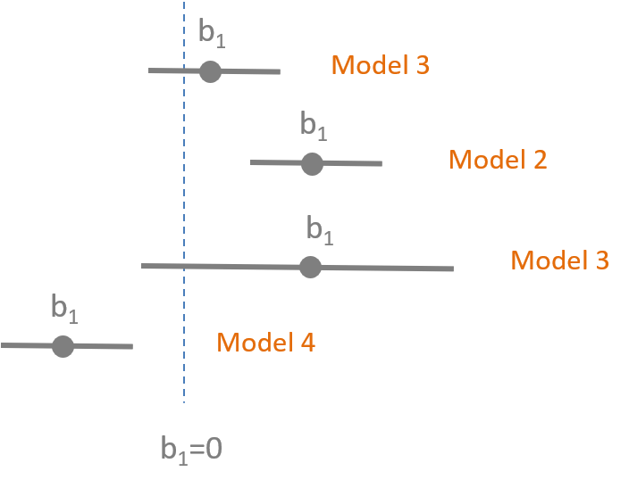

 
<!--- 
New sections start with 2 stars:  ** Section Title
New units start with 3 stars:     *** {Unit Metadata}
-----------------------------start example
** Section-I
*** { @unit = "15th Nov", @title = "Course Overview", @reading, @lecture, @assignment, @foldout }
-----------------------------end example
Unit Metadata is comprised of:
@unit - date or number
@title - unit name
@reading - turn on reading icon
@assignment - turn on lecture icon
@lecture - turn on lecture icon
@foldout - activate unit content (allow foldout)
Submit Button - <a class="uk-button uk-button-primary" href="{{page.canvas.assignment_url}}">Submit Lab</a>
-->


** Welcome


*** { @unit = "", @title = "Overview of the Program Evaluation", @lecture, @foldout  }

<br>
<br>

## Evidence-Based Practices 

 

What does it mean to live in an evidence-based world? How do we become more data-driven? 

It turns out that using data to improve decision-making and organizatoinal performance is not a trivial affair because of a little problem called omitted variable bias (correlation does not equal causation). As a result, we need to combine judicious analytical techniques with feasible approaches to research design in order to understand **causal impact** of social programs. 

Here is a great introduction to a case study that uses evaluation to better understant the impact of a government program by getting past anecdotes to measure program impact.

<br>

<iframe width="560" height="315" src="https://www.youtube.com/embed/N8rD844McrA" frameborder="0" allow="accelerometer; autoplay; encrypted-media; gyroscope; picture-in-picture" allowfullscreen></iframe>

<br>
<br>


## Understanding Causal Impact Without Randomized Control Trials

In most cases we don't have resources for large-scale Randomized Control Studies. They typically cost millions of dollars, are sometime unethical, and are often times not feasible. For example, does free trade prevent war? How do you randomized free trade across countries?

Statistics and econometricians have spent 75 years developing powerful regression tools that can be used with observational data and clever quasi-experimental research designs to tease out program impact when RCT's are not possible. The courses in the Foundations of Program Evaluation sequence build the tools to deploy these methods.

* Foundations of Eval I covers the mechanics of regression.
* Foundations of Eval II covers counterfactual analysis and quasi-experimental approaches to research design. 
* Foundations of Eval III covers seven regression models used in causal analysis (for example, [interrupted time series](https://ds4ps.org/PROG-EVAL-III/TimeSeries.html)).

Let's start with a simple example. Is caffeine good for you? 

<br>

<iframe width="560" height="315" src="https://www.youtube.com/embed/2TRcFpytYT8" frameborder="0" allow="accelerometer; autoplay; encrypted-media; gyroscope; picture-in-picture" allowfullscreen></iframe>

<br> 

What evidence is used to create these assertions? [ [link](https://www.hsph.harvard.edu/news/hsph-in-the-news/coffee-depression-women-ascherio-lucas/) ]

Can you conduct a Randomized Control Trial to study the effects of caffeine on mental health over a long period of time? Is this correlation or causation?  

How can we be sure we are measuring the causal impact of coffee on health? 

<br>

### Why is evidence-based management hard?

Just listen to this summary of current knowledge on the topic, then try to succinctly translate it to a rule of thumb physicians should use on whether to recommend coffee to patients. 

<br>

<iframe width="560" height="315" src="https://www.youtube.com/embed/OvDuBVBoV3Q" frameborder="0" allow="accelerometer; autoplay; encrypted-media; gyroscope; picture-in-picture" allowfullscreen></iframe>

<br>
<br>


*** { @unit = "", @title = "Background Reading", @reading, @foldout  }


<br>
<br>


<br>

## Program Impact 

This course provides foundational skills in quantitative program evaluation:

**Reichardt, C. S., & Bormann, C. A. (1994). Using regression models to estimate program effects. Handbook of practical program evaluation, 417-455. [ [pdf](https://github.com/DS4PS/cpp-523-fall-2019/raw/master/pubs/Estimating%20Program%20Effects%20Using%20Regression%20Models.pdf) ]**

## The Broader Field of Evaluation 

Program evaluation is a large field that deploys a diversity of methodologies beyond quantitative modeling and impact analysis. We focus heavily on the quantitative skills in the Foundations of Eval I, II, and III in this program because data is hard to use, so you need several courses to build a skill set. Qualitative and case-study approaches build from the same foundations in research design, so you can more fully develop some of those skills drawing from knowledge of formal modeling and inference.

For some useful context on evaluation as a field, this short (6-page overview) is helpful:

**McNamara, C. (2008). Basic guide to program evaluation. Free Management Library. [ [pdf](https://github.com/DS4PS/cpp-523-fall-2019/raw/master/pubs/A-Basic-Guide-to-Program-Evaluation.pdf) ]**

And to get a flavor for debates around approaches to measuring program impact in evaluation:

**White, H. (2010). A contribution to current debates in impact evaluation. Evaluation, 16(2), 153-164. [ [pdf](https://github.com/DS4PS/cpp-523-fall-2019/raw/master/pubs/Reflections-on-Impact-Evaluation-White.pdf) ]**


<br>
<br>


*** { @unit = "", @title = "Review of Basic Stats", @reading, @foldout  }


### Sampling Distributions

<br>


<br>


## Stats Review


*OpenIntro Statistics* is an excellent resource for a clear chapter on regression analysis [pdf](https://github.com/DS4PS/cpp-523-fall-2019/raw/master/pubs/openintro-statistics-sample.pdf). 

- Chapter 8 - Linear Regression 
- *Diez, D. M., Barr, C. D., & Cetinkaya-Rundel, M. (2012). OpenIntro Statistics.*

<br>

The **Teacups, Giraffes & Statistics** site has nice explanations of variance, covariance, and the standard error [ [link](https://tinystats.github.io/teacups-giraffes-and-statistics/) ]. 


<br>

If you need a refresher on stats, you can try one of the free online statistics courses on Khan Academy, EdEx, Coursera, Udacity or other sites, or visit the OpenStax free [Introductory Statistics textbook](https://cnx.org/contents/30189442-6998-4686-ac05-ed152b91b9de) and review:

- Chapter 1 – Sampling Data  
- Chapter 2 – Descriptive Statistics  
- Chapter 8 – Confidence Intervals  
- Chapter 9 – Hypothesis Testing with One Sample  
- Chapter 10 – Hypothesis Testing with Two Samples  
- Chapter 12 – Linear Regression and Correlation  


<br>
<br>


*** { @unit = "", @title = "Build Your Library", @reading, @foldout  }

# Reference Material

Regression is a tricky topic to learn because the math is the same across all fields, but statisticians, econemetricians, and other social sciences use very different notation to describe models. Finding textbooks that suits your background and your learning style will help you in the long run. 

The field of quantitative program evaluation is like a river with tributaries. The main branch consists of a set of practices around using OLS regression to estimate program impact. There are many sub-fields such as panel models, hierarchical models, Bayesian approaches, generalized least squares... etc etc. These are the tributaries in the field. 


Tributaries might also be specific practices like visualization or model diagnostics. You can build up expertise in these areas to get really good at a specific type of model that suits a specific type of research (in Psychology, for example, you would spend a lot of times learning to create and analyze interaction models so that you can deploy fancy factoral designs). 

The lecture notes for this class will focus entirely on the principles of basic regression - the main branch on this river. We intentionally try to condense the topics covered so that you can develop an understanding of how a handful of core concepts all fit together (slopes, residuals, standard errors, hypothesis testing, control variables, and bias). 

As a result, lecture notes are good for understanding these topics, but will not include all of the relevant background concepts and all of the formulas, not reference more advanced models. It is good to find a textbook that you are comfortable with so you can review concepts and look something up. I have a couple on my shelf that I return to often to look up formulas or read-up on a model I am not familiar with. 

If you want to invest in a textbook, these are some texts that present this content using algebra instead of calculus or matrix algebra notations.

* OpenStax free [Introductory Statistics textbook](https://cnx.org/contents/30189442-6998-4686-ac05-ed152b91b9de)
* *OpenIntro Statistics* [pdf](https://github.com/DS4PS/cpp-523-fall-2019/raw/master/pubs/openintro-statistics-sample.pdf), especially CH-08 Intro to Regression 
* [Discovering Statistics in R](https://www.amazon.com/Discovering-Statistics-Using-Andy-Field/dp/1446200469) as a comprehensive guide to using R for a variety of statistical models 
* [Real Stats: Using Econometrics for Political Science and Public Policy](https://www.amazon.com/Real-Stats-Econometrics-Political-Science/dp/0199981949) for material that presents regression models from a causal and evaluation perspective

**There is no way to learn and retain all of this material in one course!!!** It is completely normal for this material to not click the first time you see it. We will try to repeat concepts and build on them through the semester, and the Evaluation sequence in this program (CPP 523, 524, and 525) provide a lot of reinforcement learning. 

You are investing in a skill-set that you will build over time. I will reference material throughout the semester that you can add to your reference library for this purpose. 

I will also add books, articles, tutorials and reference sheets to the [Resources](https://ds4ps.org/cpp-523-fall-2019/resources/) page, but I suggest you create your own catalog to do the same! 

<br>
<br>


*** { @unit = "", @title = "ORIENTATION to R", @lecture, @foldout   }


## The R Language

R is a data programming language developed for statistics. 

We will be using R for lectures and labs in this course. If you are only taking the program evaluation course, **you only need a rudimentary understanding of R**. The code you need to run regressions and create tables will be provided to you. All of the datasets we will use for lectures and labs are pre-packaged, so you don't have to know how to build datasets in R. 

You will see, however, that I provide a lot of code in lecture notes. This is primarily for the students also taking the Intro to Data Science class (CPP 526) or enrolled in the masters program in data analytics. The more code you see, the more familiar it will become. It also let's you steal it and incorporate it into your own projects. **It is presented as a resource, not because you are expected to be able to make sense of all of it or use it in labs!**


## The Data Science Ecosystem

R is a foundational tool within a toolkit that I will refer to as the "data science ecosystem". 

If you were not able to make either Zoom session, I did a brief introduction to the "ecosystem" - the community of people that are creating cool analytical tools and building tutorials and case studies for how they might be applied, as well as a core set of tools that are all designed to work nicely together in order to implement projects. 

You can think of R, R Studio, and Markdown kindof like Excel (analysis), Word (report-writing), and Power Point (presentations). R allows you to analyze your data, but these results are not useful unless you can share them with others. Here is where [data-driven documents](http://ds4ps.org/dp4ss-textbook/ch-030-data-driven-docs.html) developed using R Studio and Markdown really shine. You can quickly package your R code as cool reports, websites, presentations, or dashboards to format the information in whatever way is most accessible and useful for your clients or stakeholders. 

<iframe width="560" height="315" src="https://www.youtube.com/embed/oC1xz97aoYI" frameborder="0" allow="accelerometer; autoplay; encrypted-media; gyroscope; picture-in-picture" allowfullscreen></iframe>

## Getting Help

Nerds are stereotypically perceived as being hermetic, but in reality they have just created their own universes and civilizations. Surprisingly coding is a very social activity, and real-world analytics projects are almost always collaborative. You will learn how to use discussion boards to accelerate learning and facilitate collaboration, and social coding tools like GitHub to manage large data project. 

We are going to throw a lot at you, but also provide a lot of support. Over these first couple of weeks feel free to reach out for anything you might need. 

If you find something confusing let me know (likely others will as well). 

* We can jump on a [Zoom call](https://calendly.com/lecy/15min?month=2019-08) to do a screen share if you want to walk through anything.   
* You can post a question to the homework discussion board for [data science I](https://ds4ps.org/cpp-526-fall-2019/help/) or [program evaluation I](https://ds4ps.org/cpp-523-fall-2019/help/).  
* And you can join review sessions each week.  

Reach out if you have questions or feel stuck! 


## References

[Course Overview Powerpoint for Zoom Call](https://github.com/DS4PS/dp4ss-textbook/raw/master/resources/Couse-Overview.pdf)

The course shells for CPP 523 and CPP 526 are located at:

[https://ds4ps.org/cpp-526-fall-2019/](https://ds4ps.org/cpp-526-fall-2019/)  
[https://ds4ps.org/cpp-523-fall-2019/](https://ds4ps.org/cpp-523-fall-2019/)  

The *unofficial* program website can be found at:

[https://ds4ps.org/ms-prog-eval-data-analytics/](https://ds4ps.org/ms-prog-eval-data-analytics/)

And the dashboard example in R can be found here:

[R Storyboard Example](https://beta.rstudioconnect.com/jjallaire/htmlwidgets-showcase-storyboard/htmlwidgets-showcase-storyboard.html)


** Week 1 - Nuts and Bolts of Regression Models


*** { @unit = "", @title = "Unit Overview", @reading, @foldout  }

## Description 

This section provides a review of the basic building blocks of a bivariate regression model:

* sample variance and standard deviation 
* slope 
* intercept 
* regression line 
* the "error term" or "residual"
* standard errors 

## Learning Objectives

Once you have completed this section you will be able to conceptually understand what a regression slope represents (the conditional mean), how residuals are created, and what the standard error is measuring. 


## Assigned and Recommended Articles or Chapters

### Required:


Reichardt, C. S., & Bormann, C. A. (1994). Using regression models to estimate program effects. Handbook of practical program evaluation, 417-455. [ [pdf](https://github.com/DS4PS/cpp-523-fall-2019/raw/master/pubs/Estimating%20Program%20Effects%20Using%20Regression%20Models.pdf) ]


### For reference:

Diez, D. M., Barr, C. D., & Cetinkaya-Rundel, M. (2012). OpenIntro statistics (pp. 174-175). OpenIntro. [ [**CH-08 Introduction to Linear Regression**](https://github.com/DS4PS/cpp-523-fall-2019/raw/master/pubs/openintro-statistics-sample.pdf) ]

Multiple Regression overview chapter [ [pdf](https://github.com/DS4PS/cpp-523-fall-2019/raw/master/pubs/Multiple%20Regression.pdf) ]


## Data Used in this Section

Caffeine and Heart Rates based off of this [caffeine study](https://www.theodysseyonline.com/caffeine-affect-heart-rate):

```r
# paste this code into R
url <- "https://raw.githubusercontent.com/DS4PS/cpp-523-fall-2019/master/lectures/data/caffeine.csv"
dat <- read.csv( url, stringsAsFactors=F ) 
summary( dat )
plot( dat$caffeine, dat$heart.rate )
model.01 <- lm( heart.rate ~ caffeine, data=dat )
summary( model.01 )
```

## Lecture Materials

Lecture: [ [Building a regression model](https://ds4ps.org/cpp-523-fall-2019/lectures/caffeine.html) ]

Is caffeine good for you? [ [link](https://www.hsph.harvard.edu/news/hsph-in-the-news/coffee-depression-women-ascherio-lucas/) ]

*Is caffeine a treatment in this study? How do we know caffeine is the cause of the outcomes we see here?*


## Lab Preview 

Lab-01 Regression Review covers the following topics:

* Regression slopes 
* Intercept 
* Residuals 
* Explained variance 

Good reference for formulas:  

Lewis-Beck, C., & Lewis-Beck, M. (2015). Applied regression: An introduction (Vol. 22). Sage publications. [ [pdf](https://github.com/DS4PS/cpp-523-fall-2019/raw/master/pubs/Applied%20Regression%20Lewis-Beck.pdf) ]


*** { @unit = "WED Aug-28", @title = "Lab 01", @assignment, @foldout   }


## Lab 01 - Regression Review

This lab will review the following topics:

* Calculating a bivariate regression slope (**`b1`**)
* Basic interpretation of the slope
* Intercept (**`b0`**)
* What is a residual?
  - residual (or error) sum of squares
  - regression (or explained) sum of squares 
* R-squared: the measure of variance explained 

-----

This first lab is meant as a review of some important regression formulas to either shake out the cobwebs if you have covered this material before, or get everyone on the same page if it is new. 

The lecture notes needed for the lab are available on the course shell:

[ [Building a regression model](https://ds4ps.org/cpp-523-fall-2019/lectures/caffeine.html) ]

And the first chapter from Lewis-Beck serves as a reference for specific formulas if needed:

Lewis-Beck, C., & Lewis-Beck, M. (2015). Applied regression: An introduction (Vol. 22). Sage publications. [ [pdf](https://github.com/DS4PS/cpp-523-fall-2019/raw/master/pubs/Applied%20Regression%20Lewis-Beck.pdf) ]


For THIS ASSIGNMENT all of the work is done by hand so you can type your answers right into the attached word document:

[Lab-01 Instructions](https://github.com/DS4PS/cpp-523-fall-2019/raw/master/labs/Lab-01-Regression-Review.docx)

Save it using the naming convention:

Lab-##-LastName.doc

And submit via Canvas. Please show your work (include the basic steps for each calculation).

For future assignments we will be using R Markdown documents so that you can run models and submit the results directly. 

Since this is meant as a review (or getting up to speed) assignment it is due Monday. You will, however, have a full week for subsequent labs. 

If you have questions, please post them to the [Assignment Discussion Board](https://ds4ps.org/cpp-523-fall-2019/help/).

<a class="uk-button uk-button-primary" href="https://canvas.asu.edu/courses/29527/assignments/745249">Submit Lab-01</a>


** Week 2 - Effect Size and Confidence Intervals 

*** { @unit = "", @title = "Unit Overview", @reading, @foldout }

## Description 

This week covers the topic of building confidence intervals around our estimates of program impact. We use the CIs to conduct hypothesis-testing to see if our program has the impact we expected. 

* Confidence intervals are built using standard errors 
* Standard errors are creaed from residuals 
* Residuals are generated through regression models (as we learned last week). 

## Learning Objectives

Once you have completed this section you should be able to build a confidence interval around a slope estimate of program impact, and interpret a table with several regressions. 

## Lecture Materials

Please review the following lecture notes:

* [Variance and Covariance](https://github.com/DS4PS/cpp-523-fall-2019/raw/master/lectures/p-01-variance-covariance-slope.pdf)
* [Partitioning the Variance of Y](https://github.com/DS4PS/cpp-523-fall-2019/raw/master/lectures/p-02-partitioning-variance.pdf)
* [Standard Errors](https://github.com/DS4PS/cpp-523-fall-2019/raw/master/lectures/p-03-standard-errors.pdf)
* [Confidence Intervals](https://github.com/DS4PS/cpp-523-fall-2019/raw/master/lectures/p-04-confidence-intervals.pdf)
* [Effect Size](https://github.com/DS4PS/cpp-523-fall-2019/raw/master/lectures/p-05-program-impact.pdf)

You might find this summary of notation helpful [pdf](https://github.com/DS4PS/cpp-523-fall-2019/raw/master/handouts/Common-Statistics-Notation.pdf)

## Assigned and Recommended Articles or Chapters

There are no assigned readings this week. 


## Key Take-Aways 

The lecture notes in this section cover the mechanics of standard errors and confidence intervals. These two important topics can be summed up in these animations of the sampling distribution of the mean.

Our model estimate for the slope is our best guess of the real statistic. It will always be pretty good, but not exact.


<br>

If we would repeatedly draw samples from a population and calculate slope estimates over and over, they would look like the distribution on the right. The "standard error" describes the average amount all of these guesses (statistics) are off from the true slope. 


<br>

If we create confidence intervals around these guesses, we can see that 95 out of 100 of the CIs will contain the true slope (set to 3 here). 


<br>
<br>
<br>


*** { @unit = "FRI Aug-30", @title = "Mini-Assessment", @assignment, @foldout  }


This mini-assessment consists of four multiple-choice questions. You have thirty minutes to complete from the time you start the assessment. 

<a class="uk-button uk-button-primary" href="https://canvas.asu.edu/courses/29527/quizzes/219204">Start the Mini-Assessment</a>


*** { @unit = "MON Sept-02", @title = "Lab 02", @assignment, @foldout  }


<br>
<br>

# Lab 02

This lab introduces a case study on education policy that we will be using for the remainder of the semester to demonstrate the importance and impact of control variables, and consequences of their omissions.

You will need the formula for confidence intervals, and the concept of visual hypothesis-testing with coefficient plots. 

* [Confidence Intervals](https://github.com/DS4PS/cpp-523-fall-2019/raw/master/lectures/p-04-confidence-intervals.pdf)
* [Effect Size (+hypothesis tests)](https://github.com/DS4PS/cpp-523-fall-2019/raw/master/lectures/p-05-program-impact.pdf)

<a class="uk-button uk-button-default" href="https://ds4ps.org/cpp-523-fall-2019/labs/lab-02-class-size-confidence-intervals.html">Lab-02 Instructions</a>

When you are complete:

<a class="uk-button uk-button-primary" href="https://canvas.asu.edu/courses/29527/assignments/753697">Submit Lab-02</a>

<br>
<br>


** Week 3 - Control Variables 

*** { @unit = "", @title = "Unit Overview", @reading, @foldout }

## Description 

This lecture introduces you to two distinctive types of control variables, and how the different ways they change our models. We will also start using Ballentine Venn Diagrams to compare models. 

## Learning Objectives

Once you have completed this section you will be able to explain how adding specific control variables to a model (or leaving them out) will impact (1) the slopes and (2) the standard error of your model. 


## Assigned and Recommended Articles or Chapters

### Required:

None. 

## Lecture Materials

[Lecture 06 on Control Variables](https://github.com/DS4PS/cpp-523-fall-2019/raw/master/lectures/p-06-control-variables.pdf)


*** { @unit = "FRI Sept-06", @title = "Mini-Assessment", @assignment, @foldout   }

<br>
<br>

This mini-assessment tests your understanding of the interpretation of [statistical significance using confidence intervals](https://github.com/DS4PS/cpp-523-fall-2019/raw/master/lectures/p-05-program-impact.pdf).




<a class="uk-button uk-button-primary" href="https://canvas.asu.edu/courses/29527/quizzes/220511">Start the Mini-Assessment</a>

<br>
<br>


*** { @unit = "MON Sept-09", @title = "Lab 03", @assignment, @foldout  }


<br>
<br>

# Lab 03

This lab introduces the important role of control variables in our models. They can be used to reduce standard errors of the model and thus increase model efficiency, or they can be used to to adjust slopes in the model. The lab draws on material from the lecture 06 notes. 

* [Control Variables](https://github.com/DS4PS/cpp-523-fall-2019/raw/master/lectures/p-06-control-variables.pdf)

I have provided the code for the regression models and scatterplots. This lab focuses on interpretation of results. You do need to create an RMD document, and knit an HTML file to submit your results. 

<a class="uk-button uk-button-default" href="https://ds4ps.org/cpp-523-fall-2019/labs/lab-03-instructions.html">Lab-03 Instructions</a>

When you are complete:

<a class="uk-button uk-button-primary" href="https://canvas.asu.edu/courses/29527/assignments/770250">Submit Lab-03</a>

<br>
<br>


** Week 4 - Omitted Variable Bias 

*** { @unit = "", @title = "Unit Overview", @reading, @foldout  }

## Description 

This week introduces the concept of omitted variable bias, and how it can impact our inferences in observational studies. 

## Learning Objectives

Once you have completed this section you should be able to:

* identify variables the have the potential to cause omitted variable bias 
* calculate the size of bias that results from omitting a variable from a study 


## Assigned and Recommended Articles or Chapters

### Required:

'Crack baby' study ends with unexpected but clear result [ [link](https://www.inquirer.com/philly/health/20130721__Crack_baby__study_ends_with_unexpected_but_clear_result.html) ]

* *A 1989 study in Philadelphia found that nearly one in six newborns at city hospitals had mothers who tested positive for cocaine. Troubling stories were circulating about the so-called crack babies. They had small heads and were easily agitated and prone to tremors and bad muscle tone, according to reports, many of which were anecdotal. Worse, the babies seemed aloof and avoided eye contact. Some social workers predicted a lost generation - kids with a host of learning and emotional deficits who would overwhelm school systems and not be able to hold a job or form meaningful relationships. The "crack baby" image became symbolic of bad mothering, and some cocaine-using mothers had their babies taken from them or, in a few cases, were arrested.*  

The study in the article was commissioned because of anedcotal evidence of a strong relationship between exposure to crack in the womb and poor development of a child, cognitively and socially. 

**If crack was the policy variable in this study, what was the omitted variable?** 

**How did the understanding of the DIRECT impact of crack on child development change once the omitted variable was added to the models?** 

**When are omitted variables a problem? What makes a variable a competing hypothesis?**  


## Lecture Materials

Lecture Notes: **Omitted Variable Bias** [ [pdf](https://github.com/DS4PS/cpp-523-fall-2019/raw/master/lectures/p-07-omitted-variable-bias.pdf) ]  
Lecure Notes: **A Taxonomy of Control Variables** [ [pdf](https://github.com/DS4PS/cpp-523-fall-2019/raw/master/lectures/taxonomy-of-control-variables.pdf) ]  

<br>

  

<br>

  

<br>
<br>


*** { @unit = "FRI Sept-13", @title = "Mini-Assessment", @assignment, @foldout   }

<br>
<br>

This mini-assessment tests your understanding of the differences between the two types of control variables.


[Control Variables](https://github.com/DS4PS/cpp-523-fall-2019/raw/master/lectures/p-06-control-variables.pdf)

<br>

<a class="uk-button uk-button-primary" href="https://canvas.asu.edu/courses/29527/quizzes/222622">Start the Mini-Assessment</a>


<br>
<br>


*** { @unit = "TUE Sept-17", @title = "Lab 04", @assignment, @foldout  }

<br>
<br>

# Lab 04

This lab examines the impact of omitted variable bias on our inferences. 

[Omitted Variable Bias](https://github.com/DS4PS/cpp-523-fall-2019/raw/master/lectures/p-07-omitted-variable-bias.pdf) 

A lab solutions RMD template has been provided. Submit your knitted files via Canvas. 

<a class="uk-button uk-button-default" href="https://ds4ps.org/cpp-523-fall-2019/labs/lab-04-instructions.html">Lab-04 Instructions</a>

When you are complete:

<a class="uk-button uk-button-primary" href="https://canvas.asu.edu/courses/29527/assignments/780103">Submit Lab-04</a>

<br>
<br>


** Week 5 - Dummy Variables: Revisiting Hypothesis Tests 

*** { @unit = "", @title = "Unit Overview", @reading, @foldout  }

<br>

## Description 

This week introduces modeling group differences within the data using dummy variables and interaction terms.

**Dummy variables** are binary 0/1 variables where 1 means the observation belongs to a group, 0 means the observation does not. We need one dummy variable for each level of a categorical variable. 

`y = b0 + b1(X) + b2(D) + e`

**Interactions** are created by multiplying a covariate by a dummy variable. 

`y = b0 + b1(X) + b2(D) + b3(X)(D) + e`

Adding dummy variables to models allows us to test several hypotheses about differences between groups. 

## Learning Objectives

Once you have completed this section you will be able to run and interpret regression models with dummy variables and interaction effects. 


## Assigned Lecture Materials

[Hypothesis-Testing With Groups](https://ds4ps.org/cpp-523-fall-2019/lectures/dummy-variables.html) 


## Lab Preview 

[Practice Questions](https://github.com/DS4PS/cpp-523-fall-2019/raw/master/handouts/Regression%20with%20Interaction%20Effects.pdf)


*** { @unit = "SUN Sept-22", @title = "Mini-Assessment", @assignment, @foldout  }

<br>
<br>

This mini-assessment tests your understanding of the interpretation of the impact of control variables on statistical significance.

<a class="uk-button uk-button-primary" href="https://canvas.asu.edu/courses/29527/quizzes/225183">Start the Mini-Assessment</a>

<br>
<br>


*** { @unit = "TUES Sept-24", @title = "Lab 05", @assignment, @foldout  }


<br>
<br>

# Lab 05

This lab examines tests your understanding of constructing groups and conducting tests using dummy variables. 

<a class="uk-button uk-button-default" href="https://ds4ps.org/cpp-523-fall-2019/labs/lab-05-instructions.html">Lab-05 Instructions</a>

When you are complete:

<a class="uk-button uk-button-primary" href="https://canvas.asu.edu/courses/29527/assignments/791918">Submit Lab-05</a>

<br>
<br>


** Week 6 - Specification

*** { @unit = "", @title = "Unit Overview", @reading, @foldout  }

<br>
<br>

## Description 

This week introduces the concept of specification bias - various idiosyncracies of regression models such as outliers and functional forms that can introduce bias into the slope estimates. 

## Learning Objectives

Once you have completed this section you will be able to:

* Diagnose specification bias when it occurs 
* Be able to identify outliers and conduct sensitivity analysis to check their impact 
* Specify a quadratic model for non-linear relationships 
* Interpret a logged regression 


## Lecture Materials

Specification Bias I [ [html](https://ds4ps.org/cpp-523-fall-2019/lectures/specification-bias.html) ]  
Specification Bias II [ [pdf](https://github.com/DS4PS/cpp-523-fall-2019/raw/master/lectures/p-09-specification.pdf) ]  


## Lab Preview 

For this lab you will run and interpret a quadratic regression, and interpret coefficients from a logged regression model. 

<br>
<br>


*** { @unit = "WED Oct-02", @title = "Lab 06", @assignment, @foldout  }

<br>
<br>

# Lab 06

This lab gives you a chance to practice non-linear regression models. 

<a class="uk-button uk-button-default" href="https://ds4ps.org/cpp-523-fall-2019/labs/lab-06-instructions.html">Lab-06 Instructions</a>

When you are complete:

<a class="uk-button uk-button-primary" href="https://canvas.asu.edu/courses/29527/assignments/808325">Submit Lab-06</a>

<br>
<br>


*** { @unit = "", @title = "No Mini-Assessment This Week", @assignment  }


** Week 7 - Review!


*** { @unit = "", @title = "Review", @lecture, @foldout }

<br>
<br>

Please post questions on the discussion board if you are not sure of the correct solutions for questions on lectures or practice exams. 

[Exam Review with Solutions](https://github.com/DS4PS/cpp-523-fall-2019/raw/master/handouts/Review%20Material%20for%20the%20Final%20Exam%20-%20SOLUTIONS.pdf) 

[Practice Exam](https://github.com/DS4PS/cpp-523-fall-2019/raw/master/handouts/Practice%20Exam.pdf)  

[Taxonomy of Control Variables](https://github.com/DS4PS/cpp-523-fall-2019/raw/master/lectures/taxonomy-of-control-variables.pdf)  

[Indirect Effects Example](https://github.com/DS4PS/cpp-523-fall-2019/raw/master/handouts/indirect-effect-example.pdf)  

<br>
<br>


*** { @unit = "", @title = "The Seven Deadly Sins of Regression", @lecture, @foldout   }

<br>
<br>

 
Concise summary of the seven most common issues that will corrupt your regression inferences [ [pdf](https://github.com/DS4PS/cpp-523-fall-2019/raw/master/handouts/Seven-Sins-of-Regression-Analysis.pdf) ]  

* Selection 
* Omitted variable bias 
* Measurement error 
* Specification 
* Group Heterogeneity 
* Multi-collinearity 
* Simultenaeity 

Some longer notes: Seven Sins of Regression [ [pdf](https://github.com/DS4PS/cpp-523-fall-2019/raw/master/lectures/p-10-seven-sins-of-regression.pdf) ] 

<br><br>


*** { @unit = "", @title = "Measurement Error", @lecture, @foldout  }

<br>
<br>

# The impact of measurement error

## Measurement Error in the DV

 


*Increase in standard errors. No slope bias.* 

<br>

## Measurement Error in the IV

 

<br>

 

*Attenuation of the slope (tilts toward zero), but also a decrease in standard errors that offset the shift of the slope toward zero.*

<br>
<br>


*** { @unit = "MON Oct 07", @title = "Mini-Assessment", @assignment, @foldout  }

<br>
<br>

## Mini Assessment-05 

This mini assessment covers material from the [Taxonomy of Controls](https://github.com/DS4PS/cpp-523-fall-2019/raw/master/lectures/taxonomy-of-control-variables.pdf).

And on [Measurement Error](https://ds4ps.org/cpp-523-fall-2019/schedule/). 

It is recommended you complete it before you final exam to get a sense of the types of questions to expect. I have left it open all week, though, if you need extra time. 

<a class="uk-button uk-button-primary" href="https://canvas.asu.edu/courses/29527/quizzes/232465">Mini Assessment 05</a>

<br>
<br>


** FINAL EXAM

*** { @unit = "MON Oct 7 12pm AZ", @title = "Review Session", @lecture, @foldout }

<br>
<br>

There will be a review session for the final exam at 12pm on Monday. It is a chance to bring questions from the practice exams and discuss material before taking the exam.

Please post questions on the discussion board, or email me for a Zoom call if you want help before the exam. 

<br>
<br>

*** { @unit = "Open Oct-07 to 12", @title = "Final Exam", @assignment, @foldout}


<br>
<br>

You can start the exam any time between Monday and Saturday Oct 12th. You have 4 hours to complete the exam once it is started. 

You are allowed to look back over your notes and use a calculator for help with math.

You are NOT allowed to work together on the final exam. Do not discuss questions after you have take it. 

<a class="uk-button uk-button-primary" href="https://canvas.asu.edu/courses/29527/quizzes/232776">Take the Final Exam</a>

<br>
<br>

-------

<br>
<br>


<style> 
body {
   font-family: "Roboto", sans-serif;
}
 
p.italic {
  font-style: italic;
  color: black !important;
}
td {
  text-align: left;
}
td.i {
  text-align: center;
}
iframe {
  align: middle;
}
em {
  color: black !important;
}
article {
  padding-left:20%;
}
</style>
